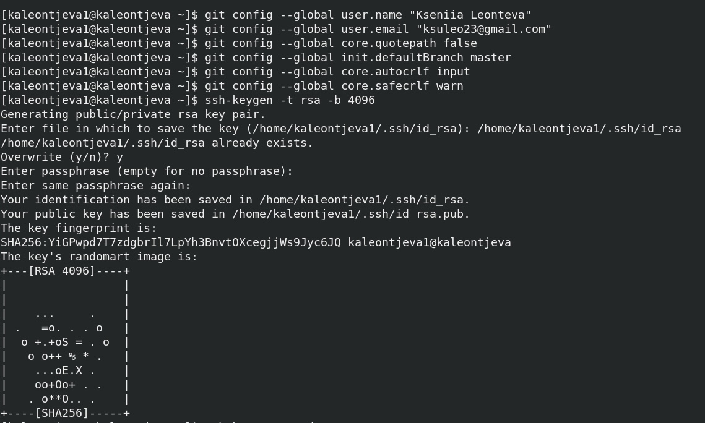
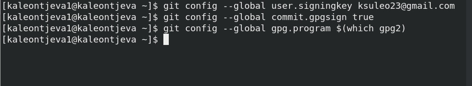

---
## Front matter
lang: ru-RU
title: Лабораторная работа №1
subtitle: Научное программирование
author:
  - Леонтьева К. А., НПМмд-02-23
institute:
  - Российский университет дружбы народов
  - Москва, Россия
date: 22 сентября 2023

## i18n babel
babel-lang: russian
babel-otherlangs: english

## Formatting pdf
toc: false
toc-title: Содержание
slide_level: 2
aspectratio: 169
section-titles: true
theme: metropolis
header-includes:
 - \metroset{progressbar=frametitle,sectionpage=progressbar,numbering=fraction}
 - '\makeatletter'
 - '\beamer@ignorenonframefalse'
 - '\makeatother'
---

## Цель лабораторной работы

Изучить идеалогию и применение средств контроля версий, а также освоить умения по работе с git.

## Теоретическое введение

__Системы контроля версий (Version Control System, VCS)__ применяются при работе нескольких человек над одним проектом. Обычно основное дерево проекта хранится в локальном или удалённом репозитории, к которому настроен доступ для участников проекта. При внесении изменений в содержание проекта система контроля версий позволяет их фиксировать, совмещать изменения, произведённые разными участниками проекта, производить откат к любой более ранней версии проекта, если это требуется.

## Ход выполнения лабораторной работы
- Вручную установили программное обеспечение git-flow

{ #fig:002 width=70% }

## Ход выполнения лабораторной работы
- Осуществили базовую настройку git

{ #fig:003 width=60% }

## Ход выполнения лабораторной работы
- Сгенерировали ключ PGP и выбрали необходимые оптции. Затем скопировали ключ и добавили его на GitHub

{ #fig:005 width=50% }

## Ход выполнения лабораторной работы
- Настроили автоматические подписи коммитов git

{ #fig:010 width=60% }

## Ход выполнения лабораторной работы
- Установили и настроили gh

{ #fig:011 width=50% }

## Ход выполнения лабораторной работы
- Создаем репозиторий курса на основе шаблона и настраиваем каталог курса

{ #fig:015 width=60% }

## Вывод
- В ходе выполнения данной лабораторной работы я изучила идеалогию и применение средств контроля версий, а также освоила умения по работе с git.

