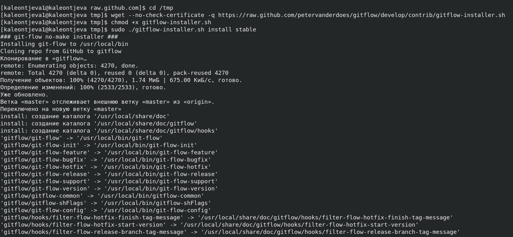
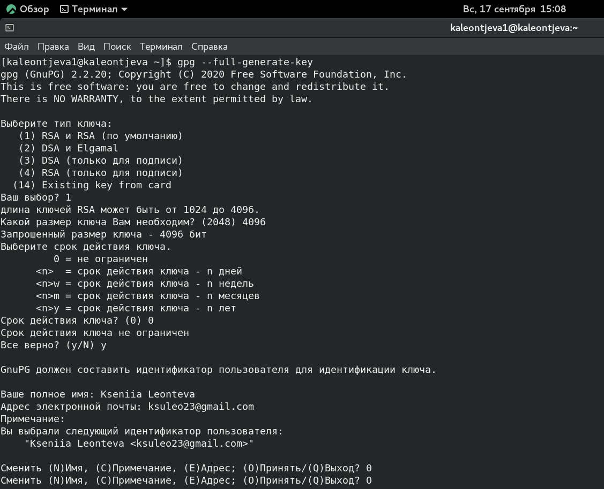
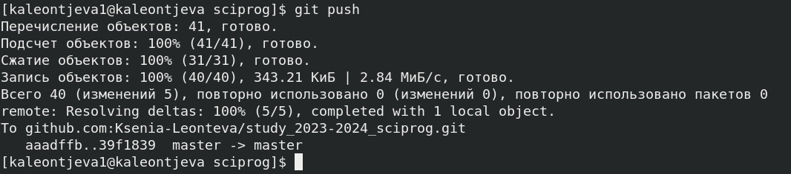

---
## Front matter
title: "Лабораторная работа №1"
subtitle: "Научное программирование"
author: "Леонтьева Ксения Андреевна | НПМмд-02-23"

## Generic otions
lang: ru-RU
toc-title: "Содержание"

## Bibliography
bibliography: bib/cite.bib
csl: pandoc/csl/gost-r-7-0-5-2008-numeric.csl

## Pdf output format
toc: true # Table of contents
toc-depth: 2
lof: true # List of figures
fontsize: 12pt
linestretch: 1.5
papersize: a4
documentclass: scrreprt
## I18n polyglossia
polyglossia-lang:
  name: russian
  options:
	- spelling=modern
	- babelshorthands=true
polyglossia-otherlangs:
  name: english
## I18n babel
babel-lang: russian
babel-otherlangs: english
## Fonts
mainfont: PT Serif
romanfont: PT Serif
sansfont: PT Sans
monofont: PT Mono
mainfontoptions: Ligatures=TeX
romanfontoptions: Ligatures=TeX
sansfontoptions: Ligatures=TeX,Scale=MatchLowercase
monofontoptions: Scale=MatchLowercase,Scale=0.9
## Biblatex
biblatex: true
biblio-style: "gost-numeric"
biblatexoptions:
  - parentracker=true
  - backend=biber
  - hyperref=auto
  - language=auto
  - autolang=other*
  - citestyle=gost-numeric
## Pandoc-crossref LaTeX customization
figureTitle: "Рис."
tableTitle: "Таблица"
listingTitle: "Листинг"
lofTitle: "Список иллюстраций"
lolTitle: "Листинги"
## Misc options
indent: true
header-includes:
  - \usepackage{indentfirst}
  - \usepackage{float} # keep figures where there are in the text
  - \floatplacement{figure}{H} # keep figures where there are in the text
---

# Цель работы

Изучить идеалогию и применение средств контроля версий, а также освоить умения по работе с git.

# Теоретическое введение

__Системы контроля версий (Version Control System, VCS)__ применяются при работе нескольких человек над одним проектом. Обычно основное дерево проекта хранится в локальном или удалённом репозитории, к которому настроен доступ для участников проекта. При внесении изменений в содержание проекта система контроля версий позволяет их фиксировать, совмещать изменения, произведённые разными участниками проекта, производить откат к любой более ранней версии проекта, если это требуется. 

В *классических системах контроля версий* используется централизованная модель, предполагающая наличие единого репозитория для хранения файлов. В отличие от классических, в *распределённых системах контроля версий* центральный репозиторий не является обязательным.

Среди классических VCS наиболее известны CVS, Subversion, а среди распределённых — Git, Bazaar, Mercurial. Принципы их работы схожи, отличаются они в основном синтаксисом используемых в работе команд.

# Выполнение лабораторной работы

Для начала была создана учетная запись и заполнены основные данные на сайте https://github.com (рис. @fig:001).

{#fig:001 width=90%}

Вручную установили программное обеспечение git-flow (рис. @fig:002).

{#fig:002 width=90%}

Осуществили базовую настройку git (рис. @fig:003), а именно: 

- задали имя и email владельца репозитория,

- настроили utf-8 в выводе сообщений git,

- настроили верификацию и подписание коммитов git,

- задали имя начальной ветки (master),

- параметр autocrlf,

- параметр safecrlf.

Также создали ключи ssh (рис. @fig:003 и рис. @fig:004):
 
- по алгоритму rsa с ключом размером 4096 бит,

- по алгоритму ed25519.

{#fig:003 width=90%}

{#fig:004 width=90%}

Сгенерировали ключ pgp и выбрали из предложенных опций необходимые (рис. @fig:005 и рис. @fig:006).

{#fig:005 width=90%}

{#fig:006 width=90%}

Выводим список ключей и копируем отпечаток приватного ключа (рис. @fig:007).

{#fig:007 width=90%}

Копируем сгенерированный PGP ключ в буфер обмена (рис. @fig:008).

{#fig:008 width=90%}

Затем переходим в настройки GitHub, в раздел keys и, нажав на кнопку New GPG key, вставляем полученный ключ в поле ввода (рис. @fig:009).

{#fig:009 width=90%}

Настраиваем автоматические подписи коммитов git. Используя введенный email, указываем Git поменять его при подписи коммитов (рис. @fig:010).

{#fig:010 width=90%}

Устанавливаем и настраиваем gh. Отвечаем на наводящие вопросы утилиты и авторизуемся через браузер (рис. @fig:011 - рис. @fig:013).

{#fig:011 width=90%}

{#fig:012 width=90%}

{#fig:013 width=100%}

Создаем репозиторий курса на основе шаблона (рис. @fig:015), параллельно сгенерировав и добавивив на GitHub еще один ssh-ключ (рис. @fig:016 и рис. @fig:017).

{#fig:015 width=90%}

{#fig:016 width=90%}

{#fig:017 width=100%}

Настраиваем каталог курса (рис. @fig:018 и рис. @fig:019):

- переходим в каталог курса,

- удаляем лишние файлы,

- создаем необходимые каталоги,

- отправляем файлы на сервер.

{#fig:018 width=90%}

{#fig:019 width=90%}

# Вывод

В ходе выполнения данной лабораторной работы я изучила идеалогию и применение средств контроля версий, а также освоила умения по работе с git.

