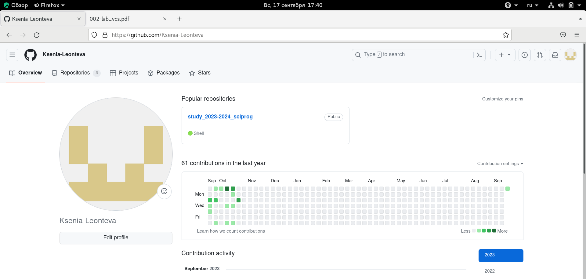
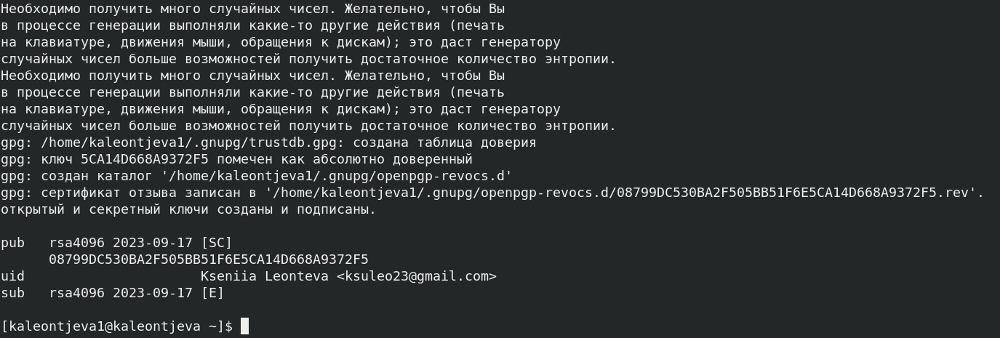
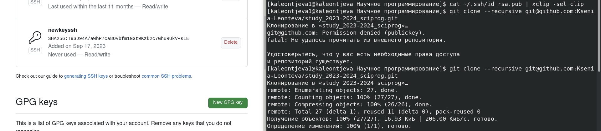

---
## Front matter
title: "Лабораторная работа №2"
subtitle: "Научное программирование"
author: "Леонтьева Ксения Андреевна | НПМмд-02-23"

## Generic otions
lang: ru-RU
toc-title: "Содержание"

## Bibliography
bibliography: bib/cite.bib
csl: pandoc/csl/gost-r-7-0-5-2008-numeric.csl

## Pdf output format
toc: true # Table of contents
toc-depth: 2
lof: true # List of figures
fontsize: 12pt
linestretch: 1.5
papersize: a4
documentclass: scrreprt
## I18n polyglossia
polyglossia-lang:
  name: russian
  options:
	- spelling=modern
	- babelshorthands=true
polyglossia-otherlangs:
  name: english
## I18n babel
babel-lang: russian
babel-otherlangs: english
## Fonts
mainfont: PT Serif
romanfont: PT Serif
sansfont: PT Sans
monofont: PT Mono
mainfontoptions: Ligatures=TeX
romanfontoptions: Ligatures=TeX
sansfontoptions: Ligatures=TeX,Scale=MatchLowercase
monofontoptions: Scale=MatchLowercase,Scale=0.9
## Biblatex
biblatex: true
biblio-style: "gost-numeric"
biblatexoptions:
  - parentracker=true
  - backend=biber
  - hyperref=auto
  - language=auto
  - autolang=other*
  - citestyle=gost-numeric
## Pandoc-crossref LaTeX customization
figureTitle: "Рис."
tableTitle: "Таблица"
listingTitle: "Листинг"
lofTitle: "Список иллюстраций"
lolTitle: "Листинги"
## Misc options
indent: true
header-includes:
  - \usepackage{indentfirst}
  - \usepackage{float} # keep figures where there are in the text
  - \floatplacement{figure}{H} # keep figures where there are in the text
---

# Цель работы

Повторить процесс оформления отчётов с помощью легковесного языка разметки Markdown.

# Теоретическое введение

__Markdown__ - это язык разметки, используемый для форматирования документов всех типов, созданный Джоном Грубером и Аароном Шварцем в 2004 году, сегодня это один из самых популярных языков среди программистов. Многие идеи языка были позаимствованы из существующих соглашений по разметке текста в электронных письмах. Реализации языка Markdown преобразуют текст в формате Markdown в валидный, правильно построенный XHTML и заменяют левые угловые скобки («<») и амперсанды («&») на соответствующие коды сущностей. Первой реализацией Markdown стала написанная Грубером реализация на Perl, однако спустя некоторое время появилось множество реализаций от сторонних разработчиков. Реализация на Perl распространяется по лицензии типа BSD. Реализации Markdown на различных языках программирования включены (или доступны в качестве плагина) во многие системы управления содержимым. 

Более подробно см. в [@Markdown:bash] 

# Выполнение лабораторной работы

В данном разделе представлен отчет по предыдущей лабораторной работе.

Для начала была создана учетная запись и заполнены основные данные на сайте https://github.com (рис. @fig:001).

{#fig:001 width=90%}

Вручную установили программное обеспечение git-flow (рис. @fig:002).

{#fig:002 width=90%}

Осуществили базовую настройку git (рис. @fig:003), а именно: 

- задали имя и email владельца репозитория,

- настроили utf-8 в выводе сообщений git,

- настроили верификацию и подписание коммитов git,

- задали имя начальной ветки (master),

- параметр autocrlf,

- параметр safecrlf.

Также создали ключи ssh (рис. @fig:003 и рис. @fig:004):
 
- по алгоритму rsa с ключом размером 4096 бит,

- по алгоритму ed25519.

{#fig:003 width=90%}

{#fig:004 width=90%}

Сгенерировали ключ pgp и выбрали из предложенных опций необходимые (рис. @fig:005 и рис. @fig:006).

{#fig:005 width=90%}

{#fig:006 width=90%}

Выводим список ключей и копируем отпечаток приватного ключа (рис. @fig:007).

{#fig:007 width=90%}

Копируем сгенерированный PGP ключ в буфер обмена (рис. @fig:008).

{#fig:008 width=90%}

Затем переходим в настройки GitHub, в раздел keys и, нажав на кнопку New GPG key, вставляем полученный ключ в поле ввода (рис. @fig:009).

{#fig:009 width=90%}

Настраиваем автоматические подписи коммитов git. Используя введенный email, указываем Git поменять его при подписи коммитов (рис. @fig:010).

{#fig:010 width=90%}

Устанавливаем и настраиваем gh. Отвечаем на наводящие вопросы утилиты и авторизуемся через браузер (рис. @fig:011 - рис. @fig:013).

{#fig:011 width=90%}

{#fig:012 width=90%}

{#fig:013 width=100%}

Создаем репозиторий курса на основе шаблона (рис. @fig:015), параллельно сгенерировав и добавивив на GitHub еще один ssh-ключ (рис. @fig:016 и рис. @fig:017).

{#fig:015 width=90%}

{#fig:016 width=90%}

{#fig:017 width=100%}

Настраиваем каталог курса (рис. @fig:018 и рис. @fig:019):

- переходим в каталог курса,

- удаляем лишние файлы,

- создаем необходимые каталоги,

- отправляем файлы на сервер.

{#fig:018 width=90%}

{#fig:019 width=90%}

# Контрольные вопросы

1. Система контроля версий (Version Control System, VCS) — это программное обеспечение, которое помогает отслеживать изменения в файловой системе и эффективно управлять версиями файлов и кода в проекте. Она позволяет разработчикам работать над проектами совместно, отслеживать, комментировать и объединять свои изменения.

2. Хранилище — место, куда помещается документ после внесения в него нужных правок. Оно является местом хранения служебной информации и всех версий документов. Commit — это пакет изменений, хранящий информацию с добавленными, отредактированными или удаленными файлами (в Git — это команда для записи индексированных изменений в репозиторий Git). История (в Git) — точный реестр всех коммитов, содержащих произведенные с файлами изменения. Рабочая копия — текущее состояние файлов проекта, основанное на версии, загруженной из хранилища.

3. Централизованные системы контроля версий представляют собой приложения типа клиент-сервер, когда репозиторий проекта существует в единственном экземпляре и хранится на сервере. Доступ к нему осуществлялся через специальное клиентское приложение. В качестве примеров таких программных продуктов можно привести CVS, Subversion. 

Децентрализованные (распределенные) системы контроля версий (Distributed Version Control System, DVCS) позволяют хранить репозиторий (его копию) у каждого разработчика, работающего с данной системой. При этом можно выделить центральный репозиторий (условно), в который будут отправляться изменения из локальных и, с ним же эти локальные репозитории будут синхронизироваться. При работе с такой системой, пользователи периодически синхронизируют свои локальные репозитории с центральным и работают непосредственно со своей локальной копией. После внесения достаточного количества изменений в локальную копию они (изменения) отправляются на сервер. При этом сервер, чаще всего, выбирается условно, т.к. в большинстве DVCS нет такого понятия как “выделенный сервер с центральным репозиторием”. Две наиболее известные DVCS – это Git, Bazaar, Mercurial.

В отличие от централизованных, в распределенных системах контроля версий центральный
репозиторий не является обязательным.

4. Создание локального репозитория. Делается предварительная конфигурация:

git config --global user.name "Имя Фамилия"

git config --global user.email "work@mail"

Настраивается utf-8 в выводе сообщений git:

git config --global quotepath false

Для инициализации локального репозитория, расположенного, например, в каталоге ~/tutorial, необходимо ввести в командной строке:

cd

mkdir tutorial

cd tutorial

git init

5. Для последующей идентификации пользователя на сервере репозиториев необходимо
сгенерировать пару ключей (приватный и открытый):

ssh-keygen -C "Имя Фамилия <work@mail>"

Ключи сохраняться в каталоге ~/.ssh/. Скопировав из локальной консоли ключ в буфер обмена:

cat ~/.ssh/id_rsa.pub | xclip -sel clip

вставляем ключ в появившееся на сайте поле.

6. Основные задачи, решаемые инструментальным средством git: обеспечение удобной командной работы над проектом и хранение информации о всех изменениях в проекте.

7. Наиболее часто используемые команды git:

* git init – создание основного дерева репозитория,

* git pull – получение обновлений (изменений) текущего дерева из центрального репозитория,

* git push – отправка всех произведённых изменений локального дерева в центральный репозиторий,

* git status – просмотр списка изменённых файлов в текущей директории,

* git diff – просмотр текущих изменения,

* git add . – добавить все изменённые и/или созданные файлы и/или каталоги,

* git add имена_файлов – добавить конкретные изменённые и/или созданные файлы и/или каталоги,

* git rm имена_файлов – удалить файл и/или каталог из индекса репозитория (при этом файл и/или каталог остаётся в локальной директории),

* git commit -am 'Описание коммита' – сохранить все добавленные изменения и все изменённые файлы,

* git commit – сохранить добавленные изменения с внесением комментария через встроенный редактор,

* git checkout -b имя_ветки – создание новой ветки, базирующейся на текущей,

* git checkout имя_ветки – переключение на некоторую ветку,

* git push origin имя_ветки – отправка изменений конкретной ветки в центральный репозиторий,

* git merge --no-ff имя_ветки – слияние ветки с текущим деревом,

* git branch -d имя_ветки – удаление локальной уже слитой с основным деревом ветки,

* git branch -D имя_ветки – принудительное удаление локальной ветки,

* git push origin :имя_ветки – удаление ветки с центрального репозитория.

8. Создание тестового файла hello.txt и добавление его в локальный репозиторий:

echo 'hello world' > hello.txt

git add hello.txt

git commit -am 'Новый файл'

9. Ветки нужны для того, чтобы при работе над проектом программисты работали незваисимо друг от друга. В Git ветки — это элемент повседневного процесса разработки. По сути ветки в Git представляют собой указатель на снимок изменений. Если нужно добавить новую возможность или исправить ошибку (незначительную или серьезную), создается новая ветка, в которой будут размещаться эти изменения. 

10. Игнорируемые файлы — это, как правило, артефакты сборки и файлы, генерируемые машиной из исходных файлов в вашем репозитории, либо файлы, которые по какой-либо иной причине не должны попадать в коммиты. Игнорируемые файлы отслеживаются в специальном файле .gitignore, который регистрируется в корневом каталоге репозитория. В Git нет специальной команды для указания игнорируемых файлов: вместо этого необходимо вручную отредактировать файл .gitignore, чтобы указать в нем новые файлы, которые должны быть проигнорированы. Файлы .gitignore содержат шаблоны, которые сопоставляются с именами файлов в репозитории для определения необходимости игнорировать эти файлы.

# Вывод

В ходе выполнения данной лабораторной работы я повторила процесс оформления отчётов с помощью легковесного языка разметки Markdown.

# Список литературы{.unnumbered}

::: {#refs}
:::

