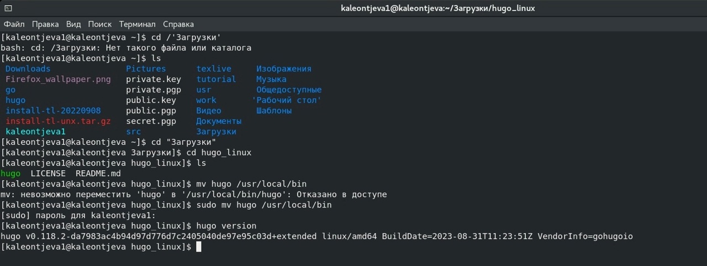
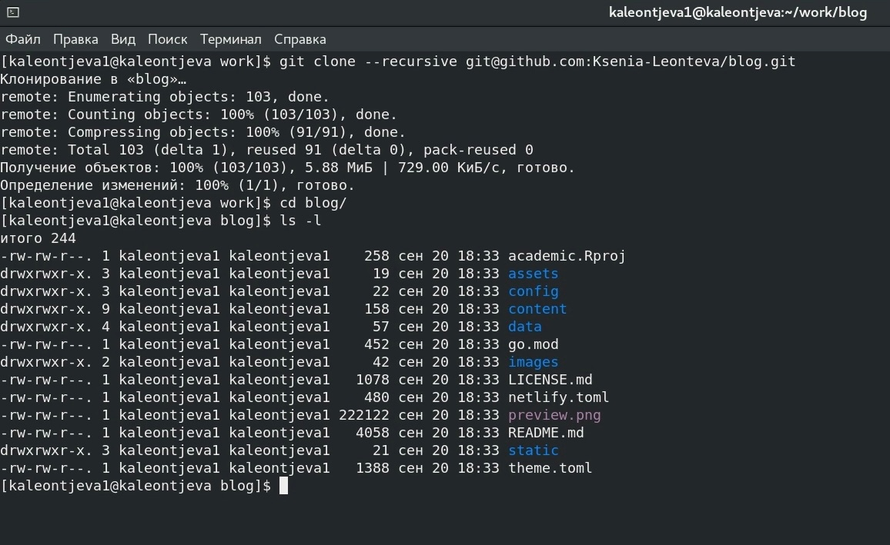
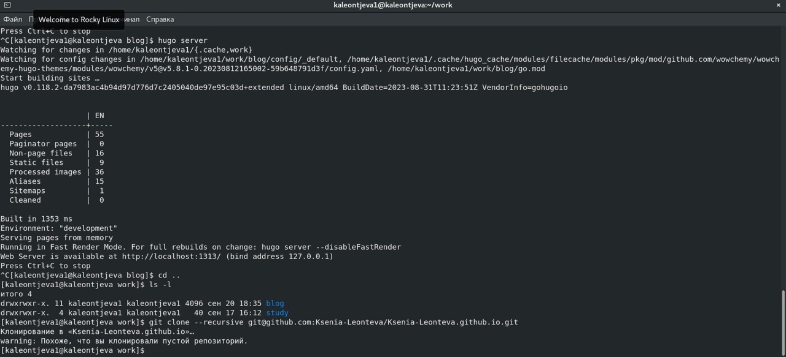
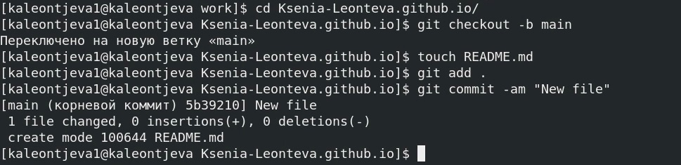
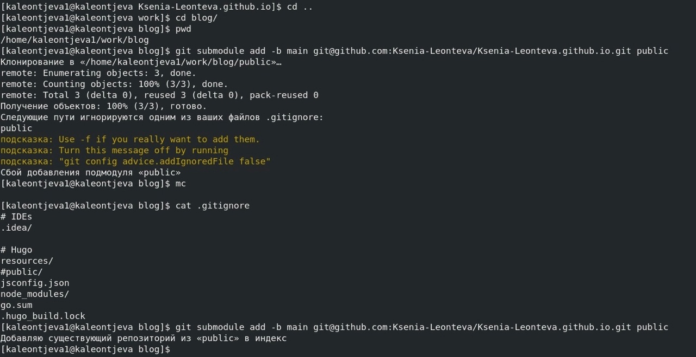
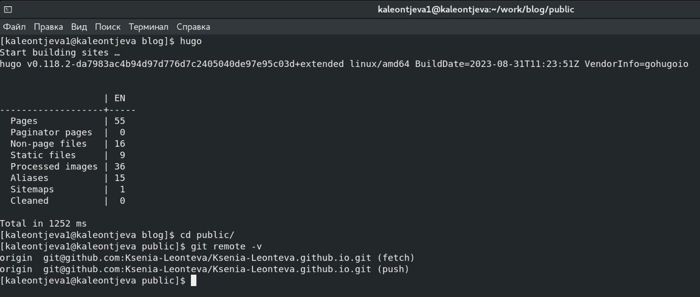
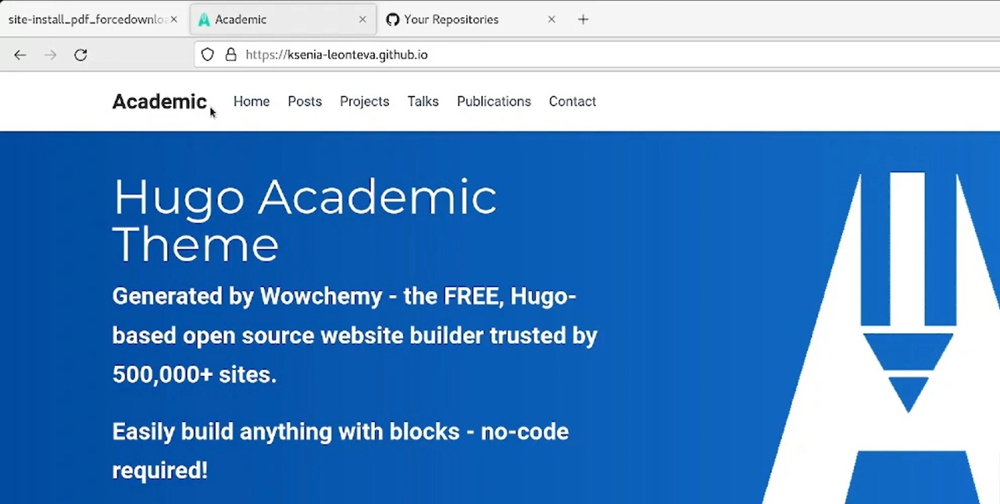

---
## Front matter
lang: ru-RU
title: Индивидуальный проект. Этап 1
subtitle: Научное программирование
author:
  - Леонтьева К. А., НПМмд-02-23
institute:
  - Российский университет дружбы народов
  - Москва, Россия
date: 21 сентября 2023

## i18n babel
babel-lang: russian
babel-otherlangs: english

## Formatting pdf
toc: false
toc-title: Содержание
slide_level: 2
aspectratio: 169
section-titles: true
theme: metropolis
header-includes:
 - \metroset{progressbar=frametitle,sectionpage=progressbar,numbering=fraction}
 - '\makeatletter'
 - '\beamer@ignorenonframefalse'
 - '\makeatother'
---

## Цель и задание первого этапа проекта

Разместить на GitHub pages заготовки для персонального сайта:

- Установить необходимое программное обеспечение,

- Скачать шаблон темы сайта,

- Разместить его на хостинге git,

- Установить параметр для URLs сайта,

- Разместить заготовку сайта на Github pages. 

## Ход выполнения первого этапа проекта
- Скачали генератор Hugo с сайта и поместили исполняемый файл hugo в папку ~/usr/local/bin

{ #fig:002 width=70% }

## Ход выполнения первого этапа проекта
- Создали каталог blog, склонировав предварительно-созданный на GitHub репозиторий

{ #fig:004 width=70% }

## Ход выполнения первого этапа проекта
- Запустили hugo server для проверки правильности действий и создали каталог Ksenia-Leonteva.github.io, склонировав предварительно-созданный на GitHub репозиторий

{ #fig:006 width=70% }

## Ход выполнения первого этапа проекта
- Создали в пустом созданном каталоге ветку main и активировали репозиторий

{ #fig:007 width=70% }

## Ход выполнения первого этапа проекта
- Подключили репозиторий к каталогу public внутри каталога blog, дополнительно изменив файл gitignore

{ #fig:009 width=70% }

## Ход выполнения первого этапа проекта
- Запустили hugo в каталоге blog, чтобы отразить изменения из blog в репозитории и добавили файлы на GitHub с помощью команд "git add .", "git commit -am "New site"" и "git push origin main"

{ #fig:010 width=70% }

## Ход выполнения первого этапа проекта
- Убедились в работоспособности сайта

{ #fig:015 width=70% }

## Вывод
- В ходе выполнения первого этапа индивидуального проекта на GitHub pages были размещены заготовки для персонального сайта.

