---
## Front matter
title: "Индивидуальный проект. Этап 1."
subtitle: "Научное программирование"
author: "Леонтьева Ксения Андреевна | НПМмд-02-23"

## Generic otions
lang: ru-RU
toc-title: "Содержание"

## Bibliography
bibliography: bib/cite.bib
csl: pandoc/csl/gost-r-7-0-5-2008-numeric.csl

## Pdf output format
toc: true # Table of contents
toc-depth: 2
lof: true # List of figures
fontsize: 12pt
linestretch: 1.5
papersize: a4
documentclass: scrreprt
## I18n polyglossia
polyglossia-lang:
  name: russian
  options:
	- spelling=modern
	- babelshorthands=true
polyglossia-otherlangs:
  name: english
## I18n babel
babel-lang: russian
babel-otherlangs: english
## Fonts
mainfont: PT Serif
romanfont: PT Serif
sansfont: PT Sans
monofont: PT Mono
mainfontoptions: Ligatures=TeX
romanfontoptions: Ligatures=TeX
sansfontoptions: Ligatures=TeX,Scale=MatchLowercase
monofontoptions: Scale=MatchLowercase,Scale=0.9
## Biblatex
biblatex: true
biblio-style: "gost-numeric"
biblatexoptions:
  - parentracker=true
  - backend=biber
  - hyperref=auto
  - language=auto
  - autolang=other*
  - citestyle=gost-numeric
## Pandoc-crossref LaTeX customization
figureTitle: "Рис."
tableTitle: "Таблица"
listingTitle: "Листинг"
lofTitle: "Список иллюстраций"
lotTitle: "Список таблиц"
lolTitle: "Листинги"
## Misc options
indent: true
header-includes:
  - \usepackage{indentfirst}
  - \usepackage{float} # keep figures where there are in the text
  - \floatplacement{figure}{H} # keep figures where there are in the text
---

# Цель работы

Разместить на GitHub pages заготовки для персонального сайта.

# Задание

- Установить необходимое программное обеспечение,

- Скачать шаблон темы сайта,

- Разместить его на хостинге git,

- Установить параметр для URLs сайта,

- Разместить заготовку сайта на Github pages.

# Теоретическое введение

Статический генератор сайта — программа, которая из различных исходных файлов (картинок, шаблонов в разных форматах, текстовых файлов и т.п) генерирует статический HTML-сайт. Один из ярких представителей — __Hugo__. Это один из самых популярных генераторов статических сайтов с открытым исходным кодом, написан на языке Go. 

Основные преимущества Hugo:

- Очень быстрый и гибкий,

- Для него легко настроить хостинг,

- Безопасный,

- Хорошая структура исходников,

- Возможность хранить содержимое в удобном формате (YAML, JSON или TOML),

- Поддержка тем. Есть готовый набор тем, более 200,

- Легко SEO-оптимизировать,

- Быстрый в освоении. Исчерпывающая документация.

# Выполнение лабораторной работы

В начале скачиваем статический генератор веб-сайтов Hugo, загрузив с сайта необходимый архив и добавив исполняемый файл hugo в папку ~/usr/local/bin (рис. @fig:001 и рис. @fig:002).

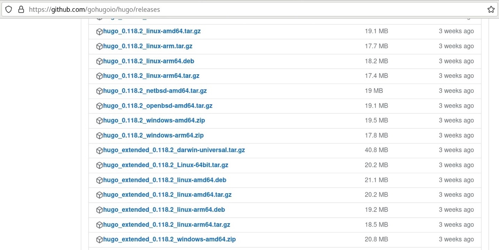{#fig:001 width=90%}

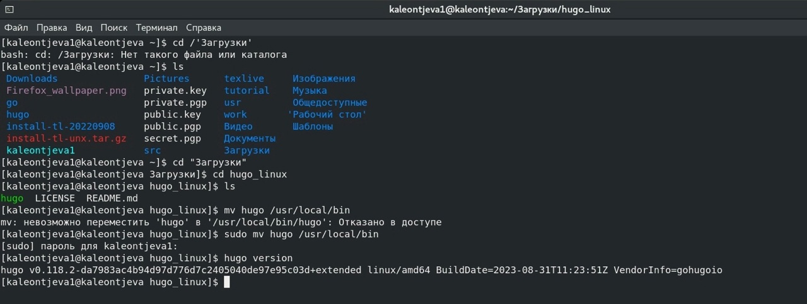{#fig:002 width=90%}

На основе репозитория https://github.com/wowchemy/starter-hugo-academic создаем свой репозиторий blog (рис. @fig:003).

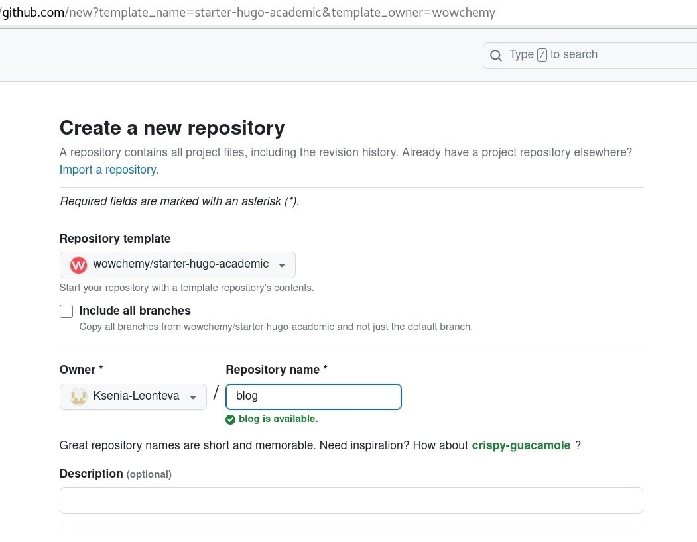{#fig:003 width=90%}

Создаем каталог blog на компьютере, клонируя репозиторий из GitHub (рис. @fig:004).

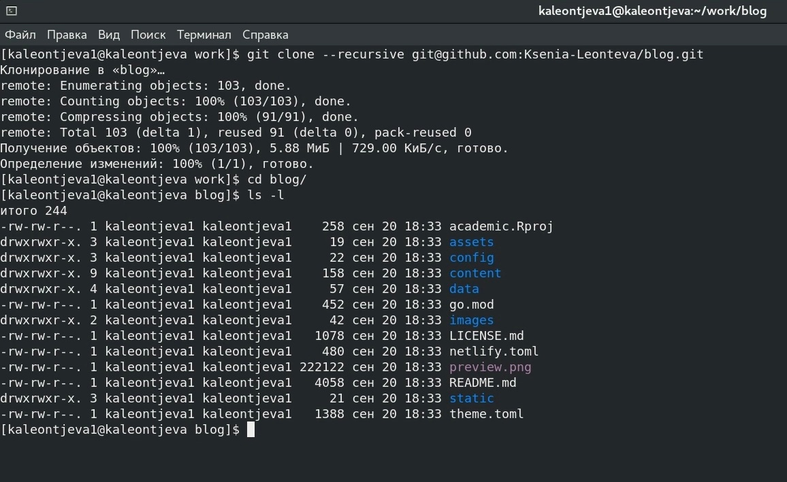{#fig:004 width=90%}

Создаем на GitHup репозиторий со специальным названием "Ksenia-Leonteva.github.io" и клонируем его на компьютер рядом с каталогом blog, а также запускаем hugo server, чтобы проверить корректность выполненных действий (рис. @fig:005 и рис. @fig:006).

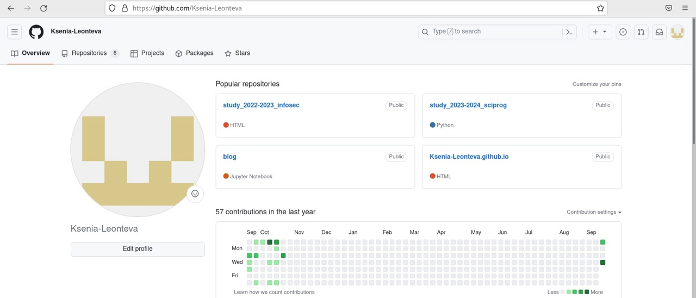{#fig:005 width=90%}

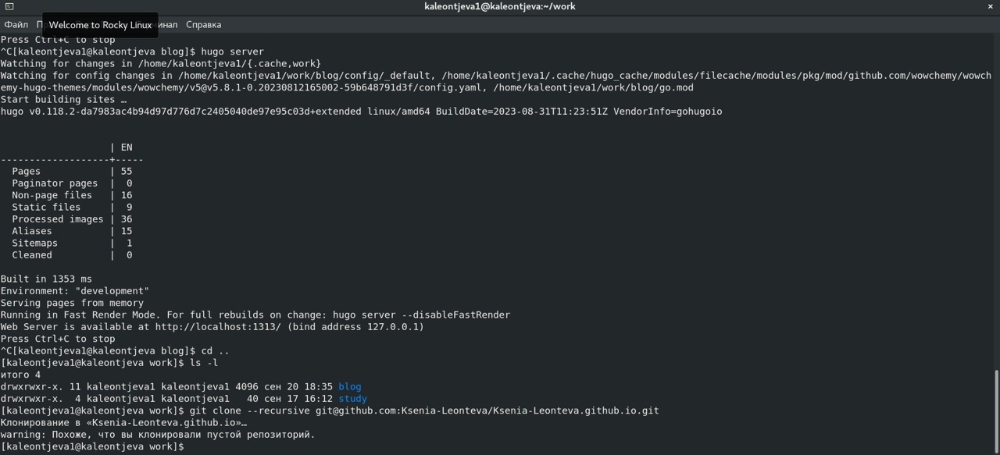{#fig:006 width=90%}

Переходим в созданный пустой репозиторий и создаем там ветку main и файл README.md, чтобы активировать репозиторий (рис. @fig:007 и рис. @fig:008).

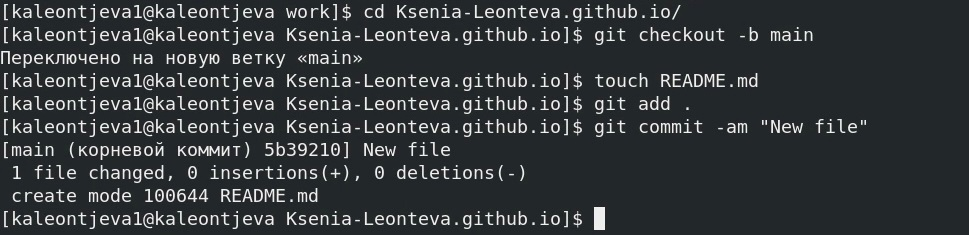{#fig:007 width=90%}

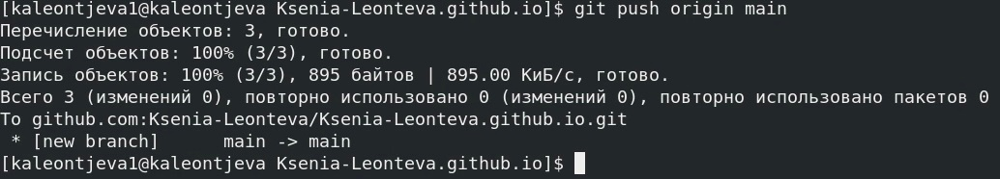{#fig:008 width=90%}

Возвращаемся в каталог blog и подключаем созданный репозиторий к каталогу public внутри каталога blog. Изменяем файл gitignore, чтобы не игнорировались каталоги с названием public (рис. @fig:009).

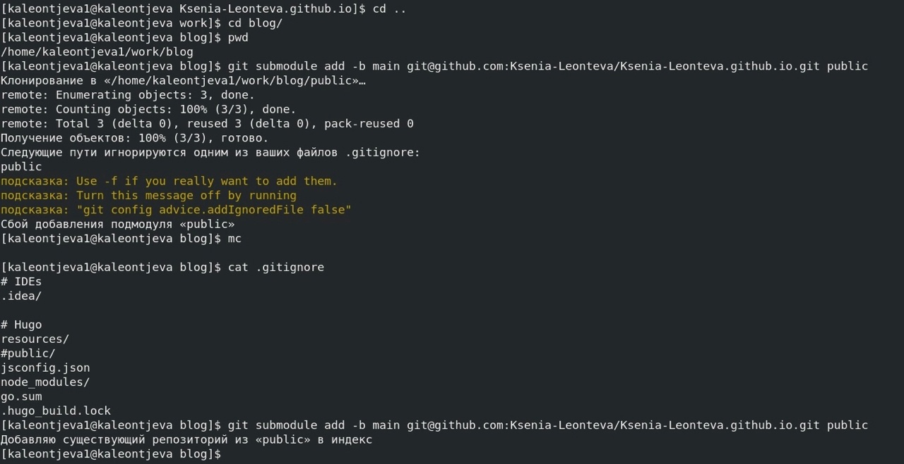{#fig:009 width=90%}

Запускаем hugo в каталоге blog, чтобы изменения из blog отразились в нашем репозитории (данную команду необходимо запускать каждый раз, когда вносятся какие-либо изменения). Проверяем, что каталог public подключен к репозиторию (рис. @fig:010 и рис. @fig:011).

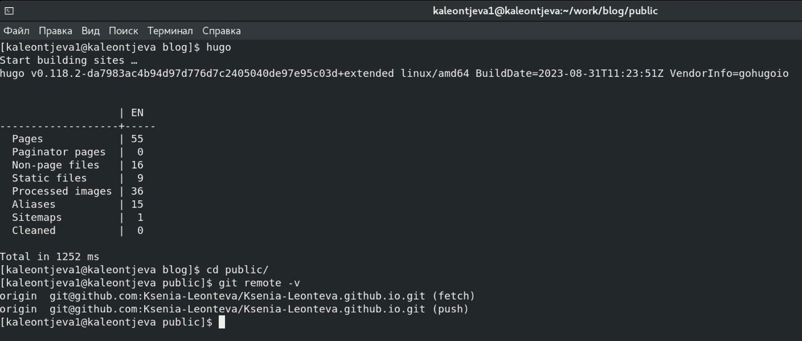{#fig:010 width=90%}

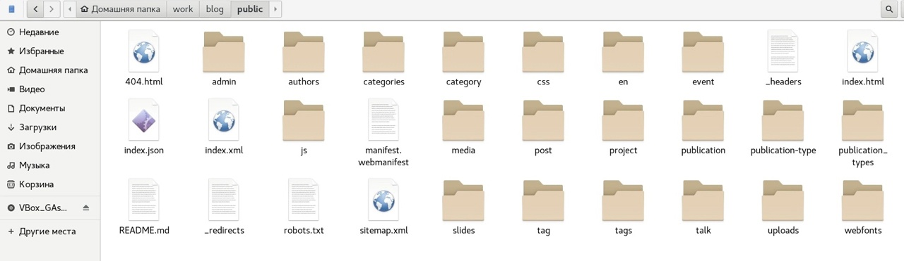{#fig:011 width=90%}

Добавляем файлы на GitHub (рис. @fig:012 и рис. @fig:013).

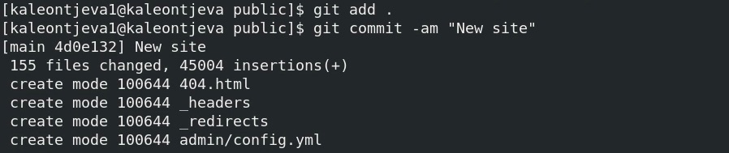{#fig:012 width=90%}

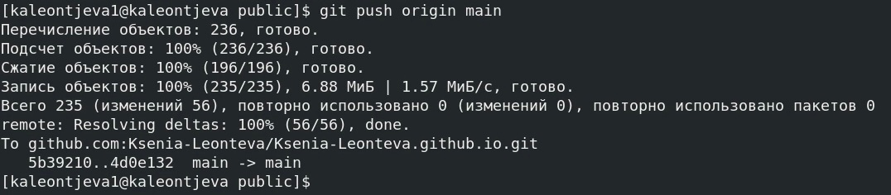{#fig:013 width=90%}

При переходе по ссылке, содержащей название созданного нами репозитория, убеждаемся, что выполненные действия были корректными (рис. @fig:014 и рис. @fig:015). Синюю заставку впоследствии можно будет убрать (на следующем этапе проекта).

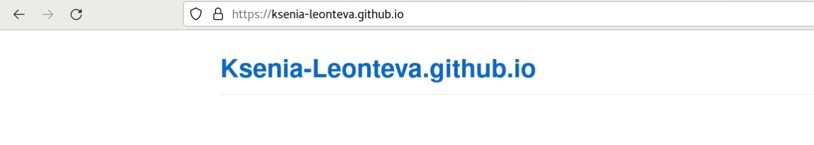{#fig:014 width=90%}

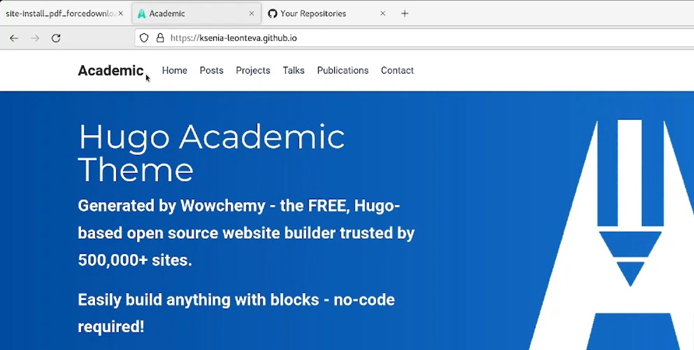{#fig:015 width=90%}

# Выводы

В ходе выполнения данной лабораторной работы на GitHub pages были размещены заготовки для персонального сайта.

