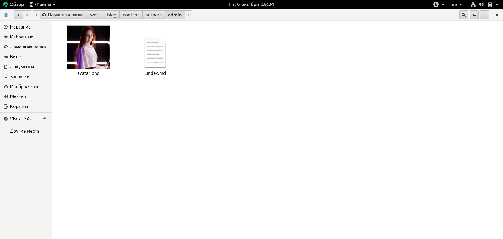
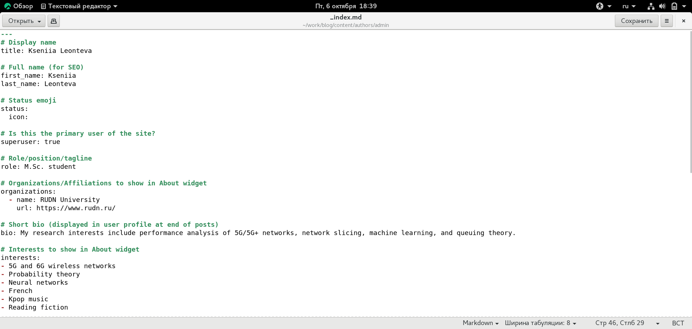
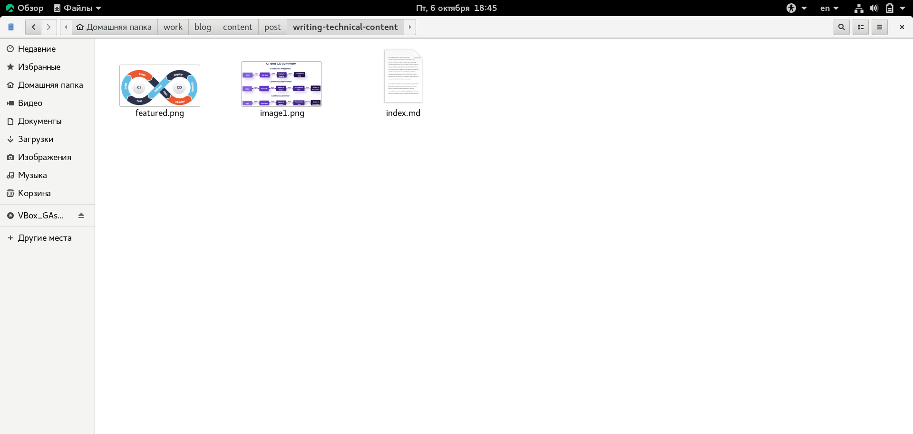
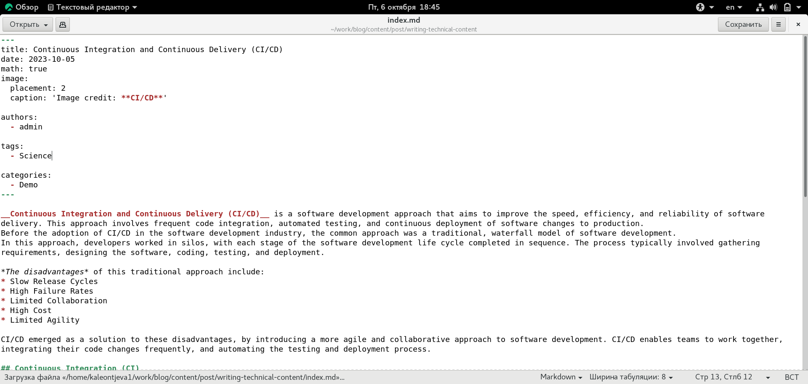
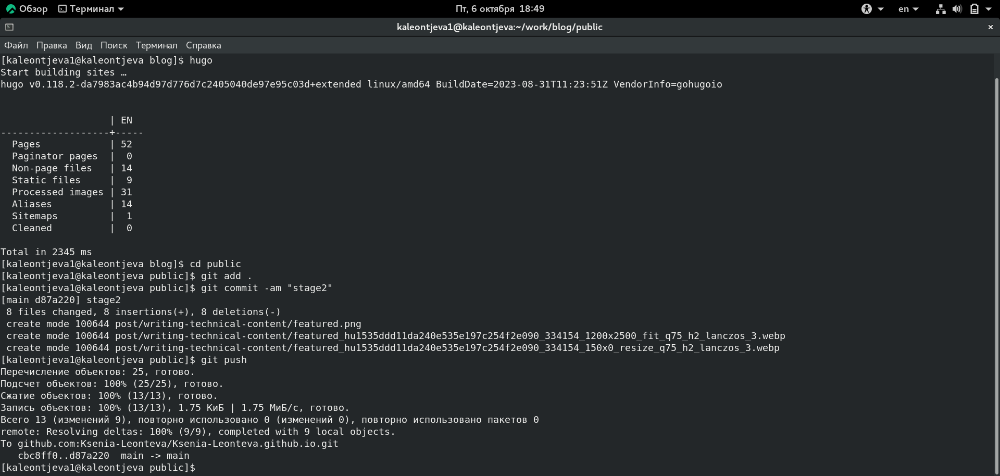
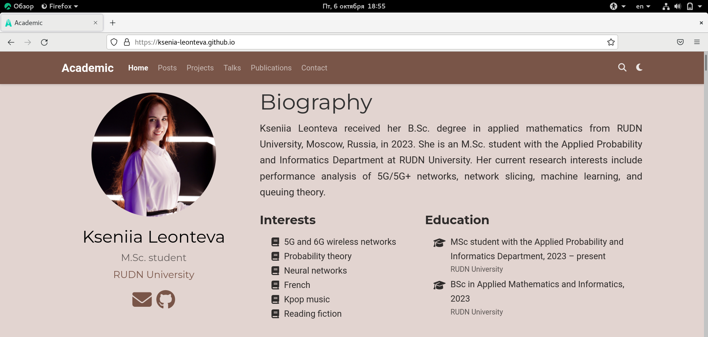
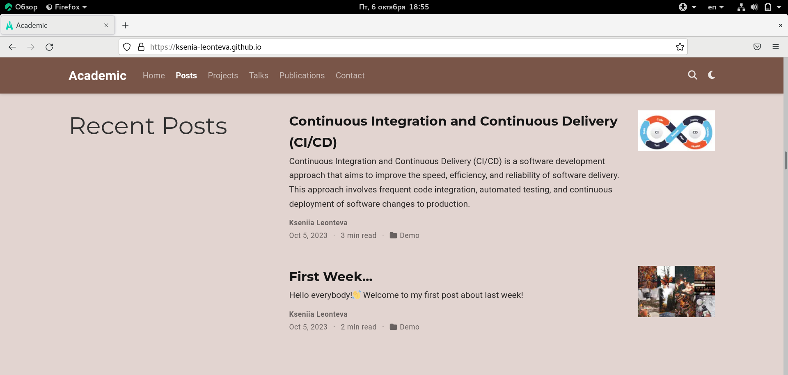

---
## Front matter
lang: ru-RU
title: Индивидуальный проект. Этап 2
subtitle: Научное программирование
author:
  - Леонтьева К. А., НПМмд-02-23
institute:
  - Российский университет дружбы народов
  - Москва, Россия
date: 6 октября 2023

## i18n babel
babel-lang: russian
babel-otherlangs: english

## Formatting pdf
toc: false
toc-title: Содержание
slide_level: 2
aspectratio: 169
section-titles: true
theme: metropolis
header-includes:
 - \metroset{progressbar=frametitle,sectionpage=progressbar,numbering=fraction}
 - '\makeatletter'
 - '\beamer@ignorenonframefalse'
 - '\makeatother'
---

## Цель и задание второго этапа проекта

Добавить на сайт данные о себе:

- Разместить фотографию владельца сайта,

- Разместить краткое описание владельца сайта (Biography),

- Добавить информацию об интересах (Interests),

- Добавить информациб об образовании (Education),

- Сделать пост по прошедшей неделе,

- Добавить пост на тему "Непрерывная интеграция и непрерывное развертывание (CI/CD)". 

## Ход выполнения второго этапа проекта
- Для загрузки фотографии на сайт в каталог work/blog/content/authors/admin было добавлено изображение "avatar.png"

{#fig:001 width=70%}

## Ход выполнения второго этапа проекта
- Для добавления информации о себе в файле work/blog/content/authors/admin/_index.md были изменены следующие разделы: Display name, Full name, Role/position/tagline, Organizations, Short bio, Interests, Education, Social/Academic Networking и основной раздел с биографией

{#fig:002 width=70%}

## Ход выполнения второго этапа проекта
- Чтобы создать посты на сайте необходимо изменить содержимое двух каталогов: work/blog/content/post/getting-started и work/blog/content/post/writing-technical-content. В данные каталоги были добавлены необходимые изображения, а также изменены файлы index.md

{ #fig:007 width=70% }

## Ход выполнения второго этапа проекта

{ #fig:008 width=70% }

## Ход выполнения второго этапа проекта
- После редактирования всех нобходимых каталогов и файлов запустили hugo и отправили файлы на GitHub

{ #fig:011 width=70% }

## Ход выполнения второго этапа проекта
- Текущая версия сайта выглядит следующим образом

{ #fig:012 width=70% }

## Ход выполнения второго этапа проекта
{ #fig:013 width=70% }

## Вывод
- В ходе выполнения второго этапа индивидуального проекта на сайт были добавлены данные о себе и два поста по требуемым темам.

