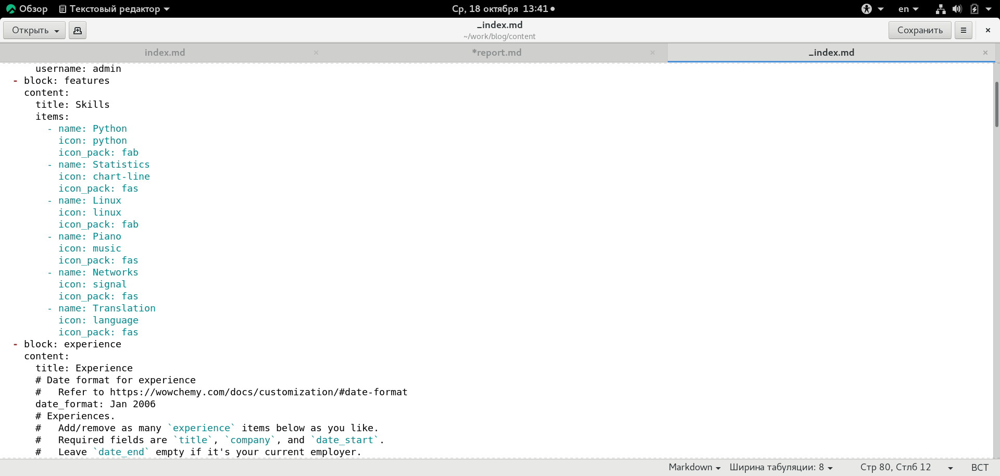
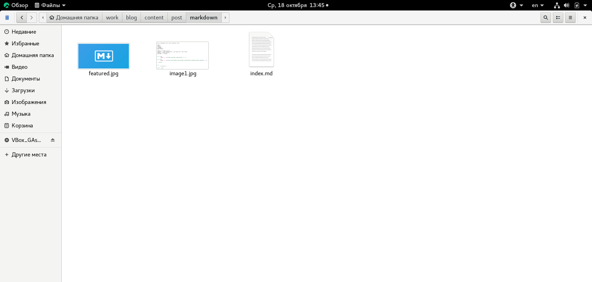
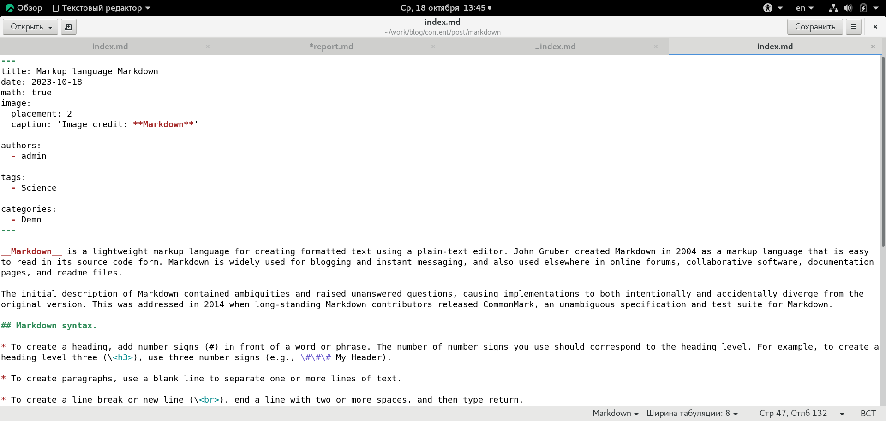
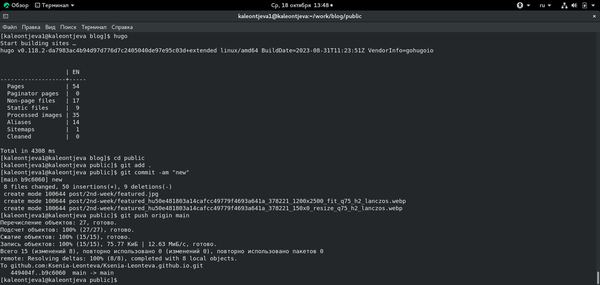
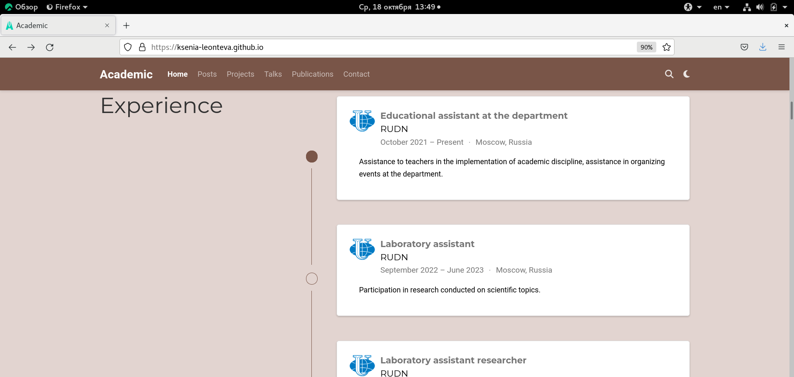
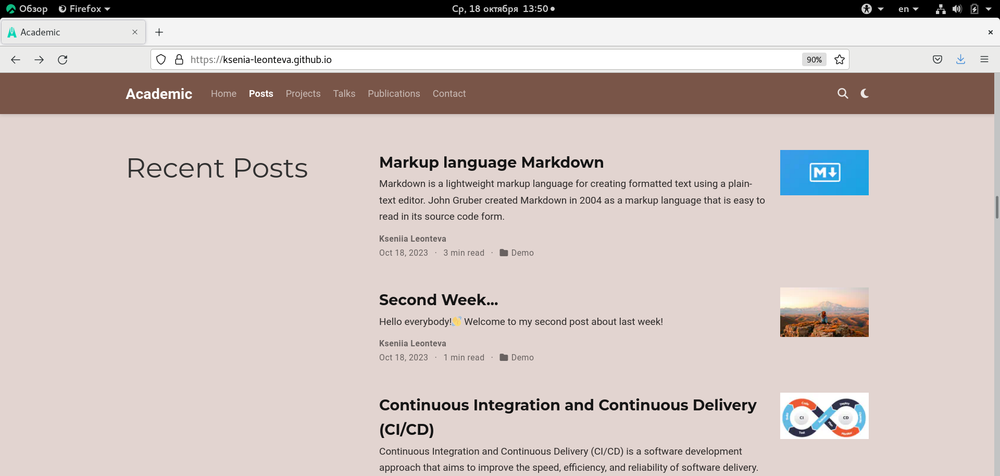

---
## Front matter
lang: ru-RU
title: Индивидуальный проект. Этап 3
subtitle: Научное программирование
author:
  - Леонтьева К. А., НПМмд-02-23
institute:
  - Российский университет дружбы народов
  - Москва, Россия
date: 18 октября 2023

## i18n babel
babel-lang: russian
babel-otherlangs: english

## Formatting pdf
toc: false
toc-title: Содержание
slide_level: 2
aspectratio: 169
section-titles: true
theme: metropolis
header-includes:
 - \metroset{progressbar=frametitle,sectionpage=progressbar,numbering=fraction}
 - '\makeatletter'
 - '\beamer@ignorenonframefalse'
 - '\makeatother'
---

## Цель и задание третьего этапа проекта

Добавить на сайт достижения:

- Добавить информацию о навыках (Skills),

- Добавить информацию об опыте (Experience),

- Добавить информацию о достижениях (Accomplishments),

- Сделать пост по прошедшей неделе,

- Добавить пост на тему "Язык разметки Markdown". 

## Ход выполнения третьего этапа проекта
- Для добавления информации о достижениях в файле work/blog/content/_index.md были изменены следующие разделы: features, experience, accomplishments. Логотип университета был добавлен в качестве изображения в папку work/blog/assets/media/icons/brands

{#fig:001 width=70%}

## Ход выполнения третьего этапа проекта
- Чтобы создать посты на сайте необходимо изменить содержимое двух созданных каталогов: work/blog/content/post/markdown и work/blog/content/post/2nd week. В данные каталоги были добавлены необходимые изображения, а также изменены файлы index.md

{ #fig:004 width=70% }

## Ход выполнения третьего этапа проекта

{ #fig:005 width=80% }

## Ход выполнения третьего этапа проекта
- После редактирования всех нeобходимых каталогов и файлов запустили hugo и отправили файлы на GitHub

{ #fig:010 width=80% }

## Ход выполнения третьего этапа проекта
- Текущая версия сайта выглядит следующим образом

{ #fig:012 width=80% }

## Ход выполнения третьего этапа проекта
{ #fig:014 width=80% }

## Вывод
- В ходе выполнения третьего этапа индивидуального проекта на сайт были добавлены данные о достижениях и два поста по требуемым темам.

