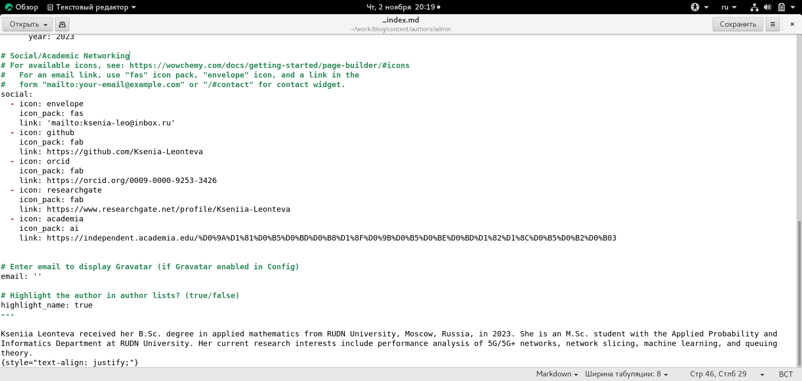
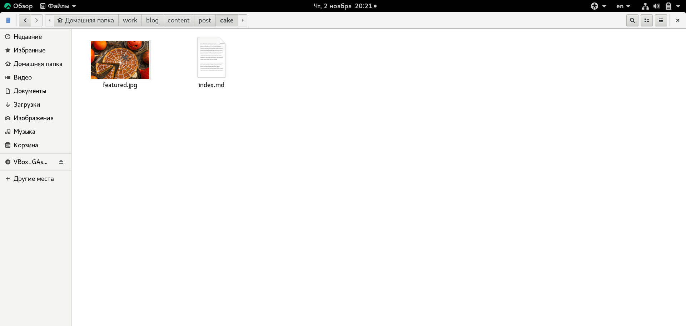
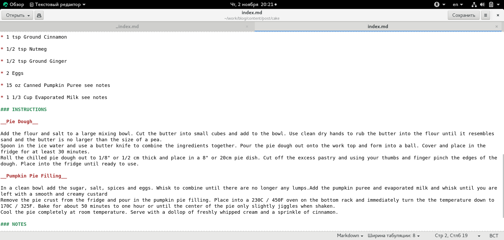
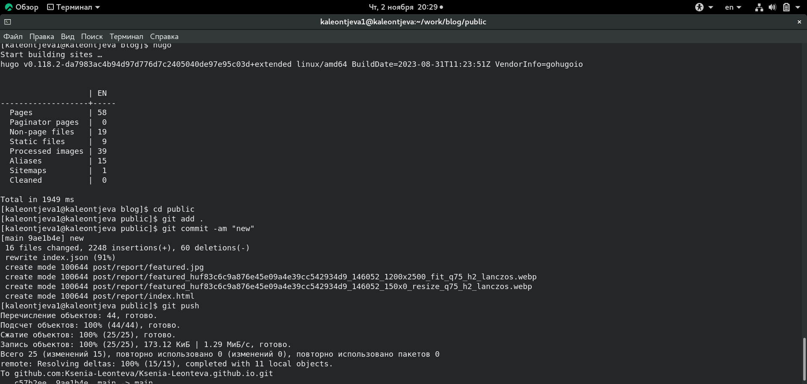
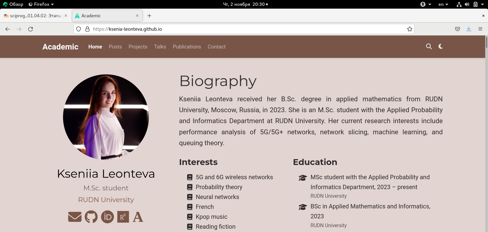
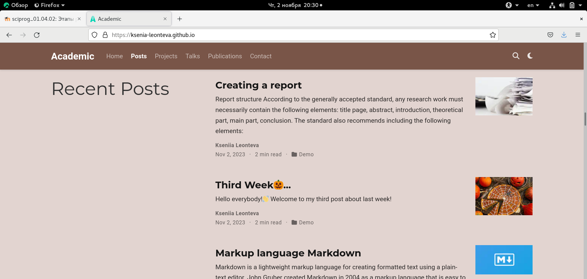

---
## Front matter
lang: ru-RU
title: Индивидуальный проект. Этап 4
subtitle: Научное программирование
author:
  - Леонтьева К. А., НПМмд-02-23
institute:
  - Российский университет дружбы народов
  - Москва, Россия
date: 2 ноября 2023

## i18n babel
babel-lang: russian
babel-otherlangs: english

## Formatting pdf
toc: false
toc-title: Содержание
slide_level: 2
aspectratio: 169
section-titles: true
theme: metropolis
header-includes:
 - \metroset{progressbar=frametitle,sectionpage=progressbar,numbering=fraction}
 - '\makeatletter'
 - '\beamer@ignorenonframefalse'
 - '\makeatother'
---

## Цель и задание четвертого этапа проекта

Добавить на сайт ссылки на научные и библиометрические ресурсы:

- Зарегистрироваться на соответствующих научных и библиометрических ресурсах и разместить на них ссылки на сайте,

- Сделать пост по прошедшей неделе,

- Добавить пост на тему "Оформление отчёта".

## Ход выполнения четвертого этапа проекта
- Для добавления ссылок на зарегистрированные профили в файле work/blog/content/authors/admin/_index.md был изменен следующий раздел: Social/Academic Networking. Иконки были взяты с сайта https://atuin.ru/blog/vse-ikonki-fontawesome-5/

{#fig:001 width=70%}

## Ход выполнения четвертого этапа проекта
- Чтобы создать посты на сайте необходимо изменить содержимое двух созданных каталогов: work/blog/content/post/cake и work/blog/content/post/report. В данные каталоги были добавлены необходимые изображения, а также изменены файлы index.md

{ #fig:002 width=70% }

## Ход выполнения четвертого этапа проекта

{ #fig:004 width=80% }

## Ход выполнения четвертого этапа проекта
- После редактирования всех нeобходимых каталогов и файлов запустили hugo и отправили файлы на GitHub

{ #fig:008 width=80% }

## Ход выполнения четвертого этапа проекта
- Текущая версия сайта выглядит следующим образом

{ #fig:009 width=80% }

## Ход выполнения четвертого этапа проекта
{ #fig:010 width=80% }

## Вывод
- В ходе выполнения четвертого этапа индивидуального проекта на сайт были добавлены ссылки на профили научных и библиометрических ресурсов и два поста по требуемым темам.

