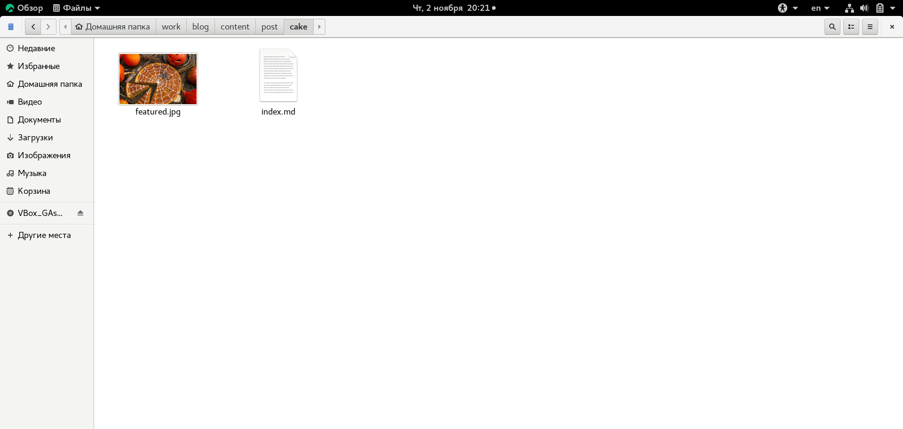
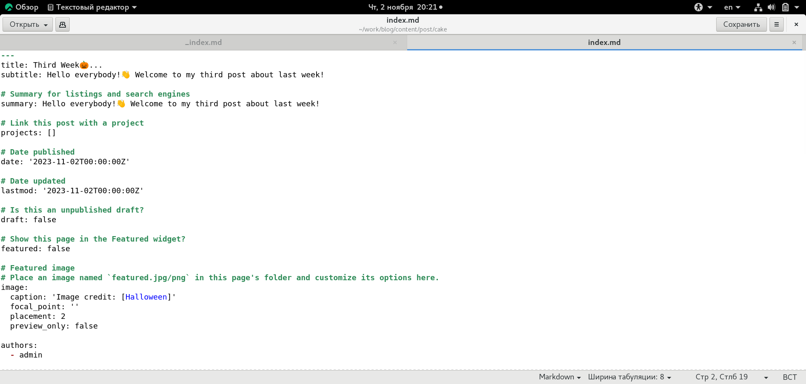
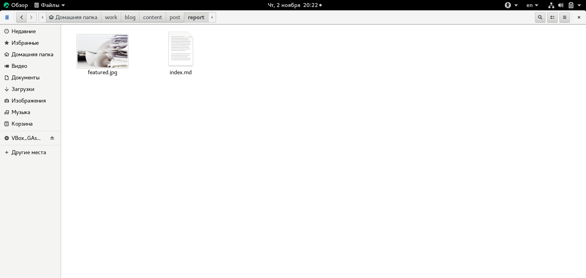
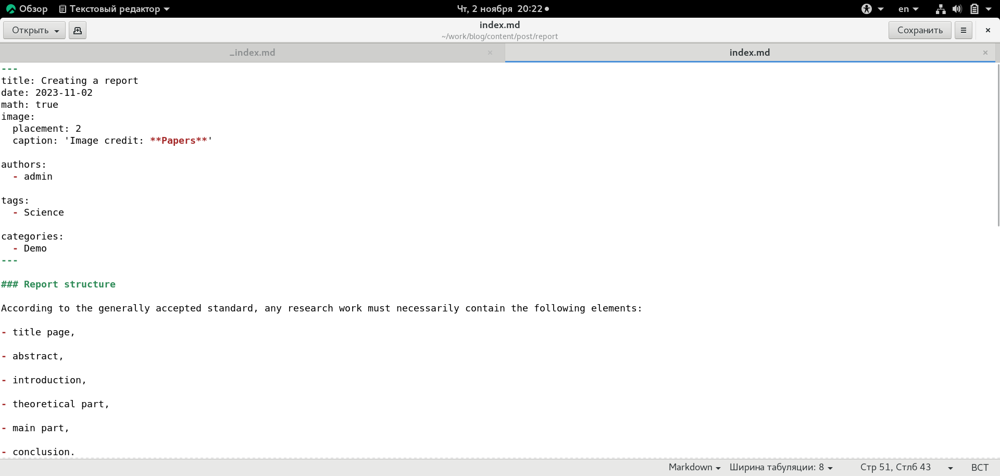
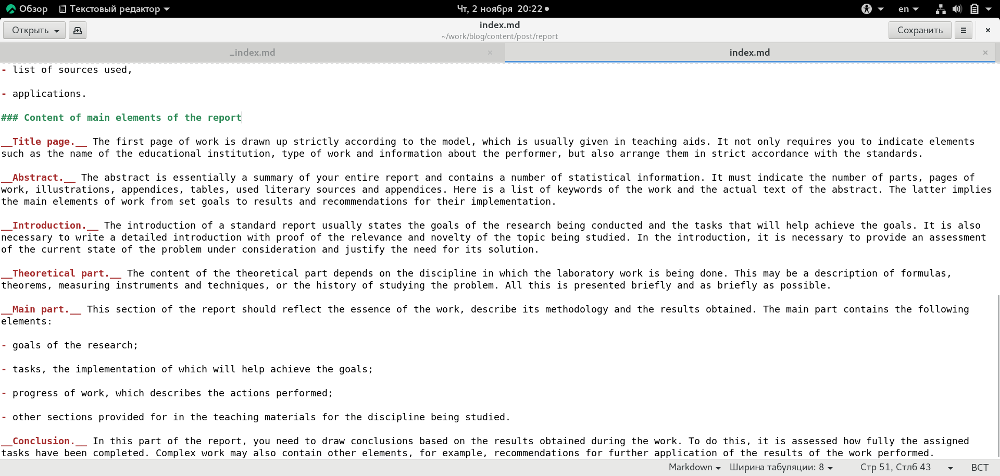
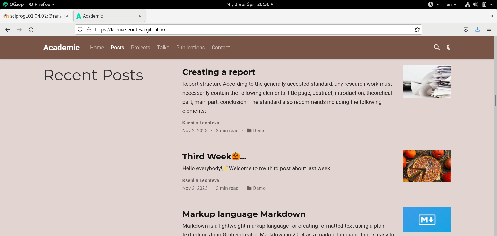
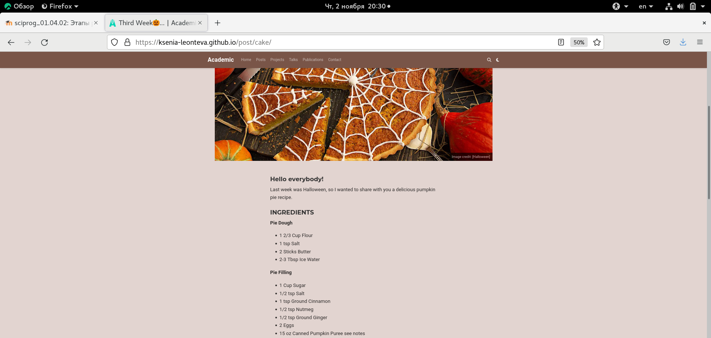
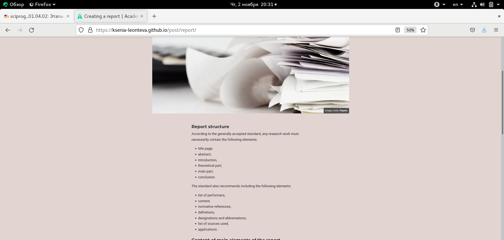

---
## Front matter
title: "Индивидуальный проект. Этап 4."
subtitle: "Научное программирование"
author: "Леонтьева Ксения Андреевна | НПМмд-02-23"

## Generic otions
lang: ru-RU
toc-title: "Содержание"

## Bibliography
bibliography: bib/cite.bib
csl: pandoc/csl/gost-r-7-0-5-2008-numeric.csl

## Pdf output format
toc: true # Table of contents
toc-depth: 2
lof: true # List of figures
fontsize: 12pt
linestretch: 1.5
papersize: a4
documentclass: scrreprt
## I18n polyglossia
polyglossia-lang:
  name: russian
  options:
	- spelling=modern
	- babelshorthands=true
polyglossia-otherlangs:
  name: english
## I18n babel
babel-lang: russian
babel-otherlangs: english
## Fonts
mainfont: PT Serif
romanfont: PT Serif
sansfont: PT Sans
monofont: PT Mono
mainfontoptions: Ligatures=TeX
romanfontoptions: Ligatures=TeX
sansfontoptions: Ligatures=TeX,Scale=MatchLowercase
monofontoptions: Scale=MatchLowercase,Scale=0.9
## Biblatex
biblatex: true
biblio-style: "gost-numeric"
biblatexoptions:
  - parentracker=true
  - backend=biber
  - hyperref=auto
  - language=auto
  - autolang=other*
  - citestyle=gost-numeric
## Pandoc-crossref LaTeX customization
figureTitle: "Рис."
tableTitle: "Таблица"
listingTitle: "Листинг"
lofTitle: "Список иллюстраций"
lotTitle: "Список таблиц"
lolTitle: "Листинги"
## Misc options
indent: true
header-includes:
  - \usepackage{indentfirst}
  - \usepackage{float} # keep figures where there are in the text
  - \floatplacement{figure}{H} # keep figures where there are in the text
---

# Цель работы

Добавить на сайт ссылки на научные и библиометрические ресурсы.

# Задание

- Зарегистрироваться на соответствующих научных и библиометрических ресурсах и разместить на них ссылки на сайте,

- Сделать пост по прошедшей неделе,

- Добавить пост на тему "Оформление отчёта".

# Теоретическое введение

Статический генератор сайта — программа, которая из различных исходных файлов (картинок, шаблонов в разных форматах, текстовых файлов и т.п) генерирует статический HTML-сайт. Один из ярких представителей — __Hugo__. Это один из самых популярных генераторов статических сайтов с открытым исходным кодом, написан на языке Go. 

Основные преимущества Hugo:

- Очень быстрый и гибкий,

- Для него легко настроить хостинг,

- Безопасный,

- Хорошая структура исходников,

- Возможность хранить содержимое в удобном формате (YAML, JSON или TOML),

- Поддержка тем. Есть готовый набор тем, более 200,

- Легко SEO-оптимизировать,

- Быстрый в освоении. Исчерпывающая документация.

Более подробно см. в [@hugo:bash] 

# Выполнение лабораторной работы

Для добавления ссылок на зарегистрированные профили в файле work/blog/content/authors /admin/_index.md был изменен следующий раздел: Social/Academic Networking (рис. @fig:001). Иконки были взяты с сайта https://atuin.ru/blog/vse-ikonki-fontawesome-5/.

{#fig:001 width=110%}

Чтобы создать посты на сайте необходимо изменить содержимое двух созданных каталогов: work/blog/content/post/cake и work/blog/content/post/report. В данные каталоги были добавлены необходимые изображения, а также изменены файлы index.md (рис. @fig:002) - (рис. @fig:007).

{#fig:002 width=110%}

{#fig:003 width=110%}

{#fig:004 width=110%}

{#fig:005 width=110%}

{#fig:006 width=110%}

{#fig:007 width=110%}

После редактирования всех необходимых каталогов и файлов запустили hugo и отправили файлы на GitHub (рис. @fig:008).

{#fig:008 width=110%}

Таким образом, текущая версия сайта выглядит следующим образом (рис. @fig:009) - (рис. @fig:012).

{#fig:009 width=110%}

{#fig:010 width=110%}

{#fig:011 width=110%}

{#fig:012 width=110%}

# Выводы

В ходе выполнения четвертого этапа индивидуального проекта на сайт были добавлены ссылки на профили научных и библиометрических ресурсов и два поста по требуемым темам.

# Список литературы{.unnumbered}

::: {#refs}
:::

