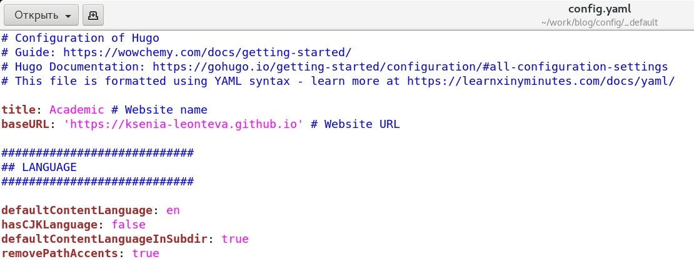
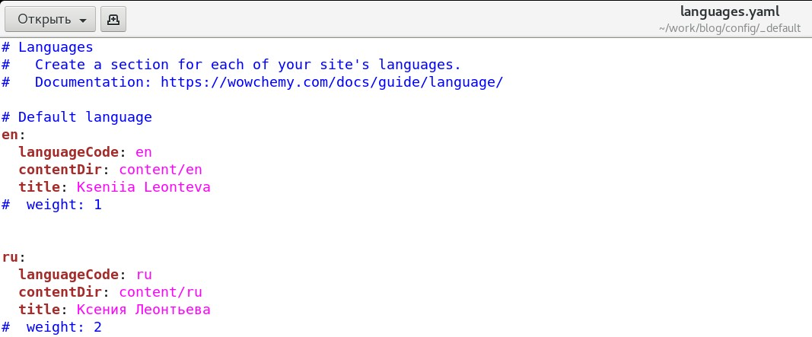
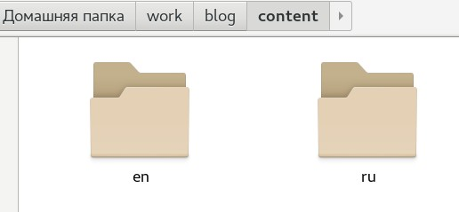
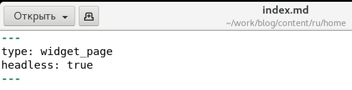
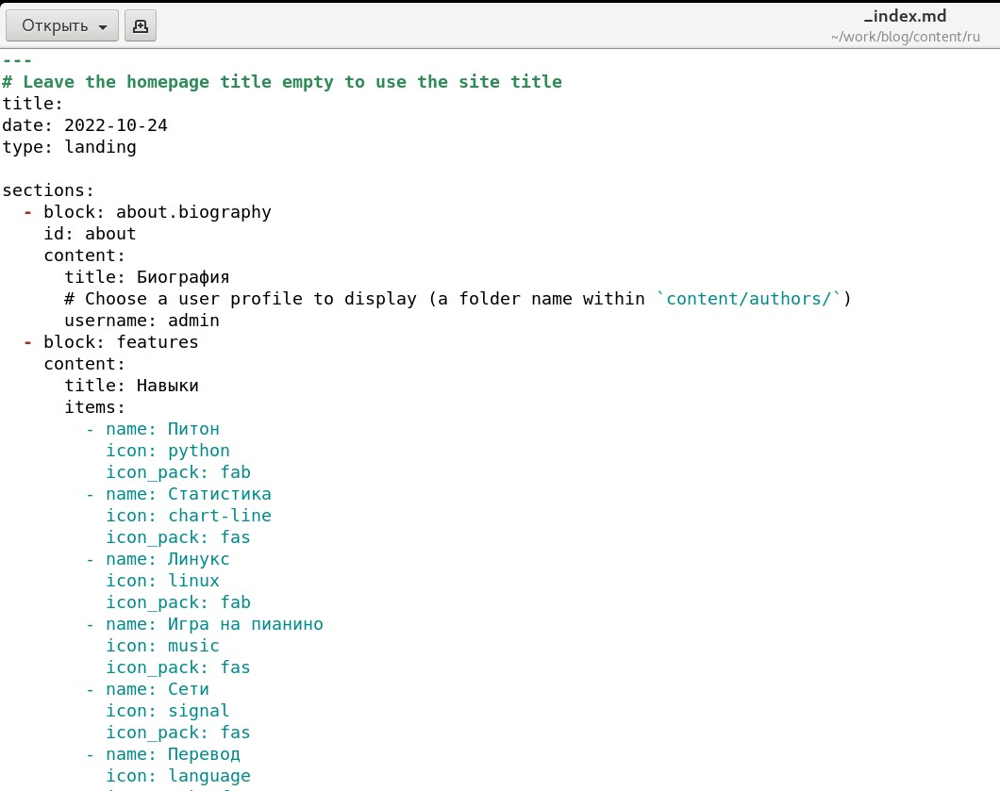
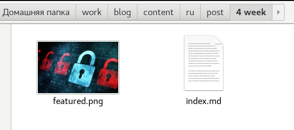
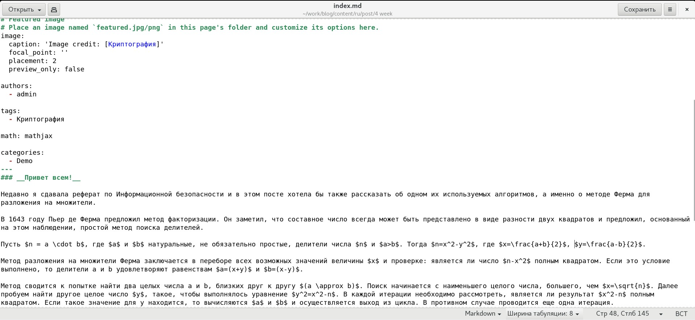
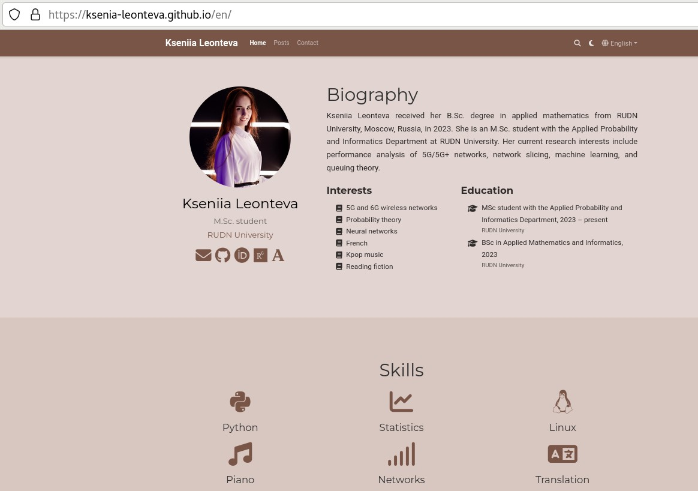
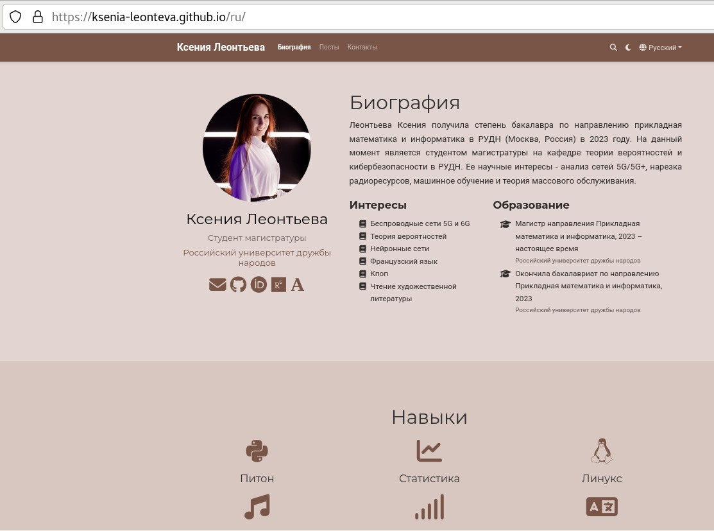

---
## Front matter
lang: ru-RU
title: Индивидуальный проект. Этап 5
subtitle: Научное программирование
author:
  - Леонтьева К. А., НПМмд-02-23
institute:
  - Российский университет дружбы народов
  - Москва, Россия
date: 15 ноября 2023

## i18n babel
babel-lang: russian
babel-otherlangs: english

## Formatting pdf
toc: false
toc-title: Содержание
slide_level: 2
aspectratio: 169
section-titles: true
theme: metropolis
header-includes:
 - \metroset{progressbar=frametitle,sectionpage=progressbar,numbering=fraction}
 - '\makeatletter'
 - '\beamer@ignorenonframefalse'
 - '\makeatother'
---

## Цель и задание пятого этапа проекта

Размещение двуязычного сайта на GitHub:

- Сделать поддержку английского и русского языков,

- Разместить элементы сайта на обоих языках,

- Разместить контент на обоих языках,

- Сделать пост по прошедшей неделе,

- Добавить пост на тему "Языки научного программирования".

## Ход выполнения пятого этапа проекта
- Для того, чтобы сайт поддерживал два языка, необходимо изменить содержание следующих файлов в каталоге work/blog/config/_default: config.yaml, languages.yaml, menus.en.yaml, menus.ru.yaml, params.yaml

{#fig:001 width=90%}

## Ход выполнения пятого этапа проекта

{#fig:002 width=90%}

## Ход выполнения пятого этапа проекта

Кроме этого необходимо создать в каталоге work/blog/content два каталога en и ru, в которые переместить каталоги с контентом. В этих же каталогах были созданы каталоги home с файлом index.md.

{#fig:006 width=30%}

{#fig:007 width=30%}

## Ход выполнения пятого этапа проекта

Далее в каталоге work/blog/content/ru были изменены файлы _index.md и authors/admin/_index.md.

{#fig:008 width=50%}

## Ход выполнения пятого этапа проекта
- Были созданы каталоги для соответствующих постов на русском и английском

{ #fig:010 width=70% }

## Ход выполнения пятого этапа проекта

{ #fig:011 width=100% }

## Ход выполнения пятого этапа проекта
- Текущая версия сайта выглядит следующим образом

{ #fig:015 width=55% }

## Ход выполнения пятого этапа проекта
{ #fig:016 width=65% }

## Вывод
- В ходе выполнения пятого этапа индивидуального проекта на GitHub был размещен двуязычный сайт.

