---
## Front matter
title: "Индивидуальный проект. Этап 5."
subtitle: "Научное программирование"
author: "Леонтьева Ксения Андреевна | НПМмд-02-23"

## Generic otions
lang: ru-RU
toc-title: "Содержание"

## Bibliography
bibliography: bib/cite.bib
csl: pandoc/csl/gost-r-7-0-5-2008-numeric.csl

## Pdf output format
toc: true # Table of contents
toc-depth: 2
lof: true # List of figures
fontsize: 12pt
linestretch: 1.5
papersize: a4
documentclass: scrreprt
## I18n polyglossia
polyglossia-lang:
  name: russian
  options:
	- spelling=modern
	- babelshorthands=true
polyglossia-otherlangs:
  name: english
## I18n babel
babel-lang: russian
babel-otherlangs: english
## Fonts
mainfont: PT Serif
romanfont: PT Serif
sansfont: PT Sans
monofont: PT Mono
mainfontoptions: Ligatures=TeX
romanfontoptions: Ligatures=TeX
sansfontoptions: Ligatures=TeX,Scale=MatchLowercase
monofontoptions: Scale=MatchLowercase,Scale=0.9
## Biblatex
biblatex: true
biblio-style: "gost-numeric"
biblatexoptions:
  - parentracker=true
  - backend=biber
  - hyperref=auto
  - language=auto
  - autolang=other*
  - citestyle=gost-numeric
## Pandoc-crossref LaTeX customization
figureTitle: "Рис."
tableTitle: "Таблица"
listingTitle: "Листинг"
lofTitle: "Список иллюстраций"
lotTitle: "Список таблиц"
lolTitle: "Листинги"
## Misc options
indent: true
header-includes:
  - \usepackage{indentfirst}
  - \usepackage{float} # keep figures where there are in the text
  - \floatplacement{figure}{H} # keep figures where there are in the text
---

# Цель работы

Размещение двуязычного сайта на GitHub.

# Задание

- Сделать поддержку английского и русского языков,

- Разместить элементы сайта на обоих языках,

- Разместить контент на обоих языках,

- Сделать пост по прошедшей неделе,

- Добавить пост на тему "Языки научного программирования".

# Теоретическое введение

Статический генератор сайта — программа, которая из различных исходных файлов (картинок, шаблонов в разных форматах, текстовых файлов и т.п) генерирует статический HTML-сайт. Один из ярких представителей — __Hugo__. Это один из самых популярных генераторов статических сайтов с открытым исходным кодом, написан на языке Go. 

Основные преимущества Hugo:

- Очень быстрый и гибкий,

- Для него легко настроить хостинг,

- Безопасный,

- Хорошая структура исходников,

- Возможность хранить содержимое в удобном формате (YAML, JSON или TOML),

- Поддержка тем. Есть готовый набор тем, более 200,

- Легко SEO-оптимизировать,

- Быстрый в освоении. Исчерпывающая документация.

Более подробно см. в [@hugo:bash] 

# Выполнение лабораторной работы

Для того, чтобы сайт поддерживал два языка, необходимо изменить содержание следующих файлов в каталоге work/blog/config/_default: config.yaml, languages.yaml, menus.en.yaml, menus.ru.yaml, params.yaml (рис. @fig:001 - @fig:005). 

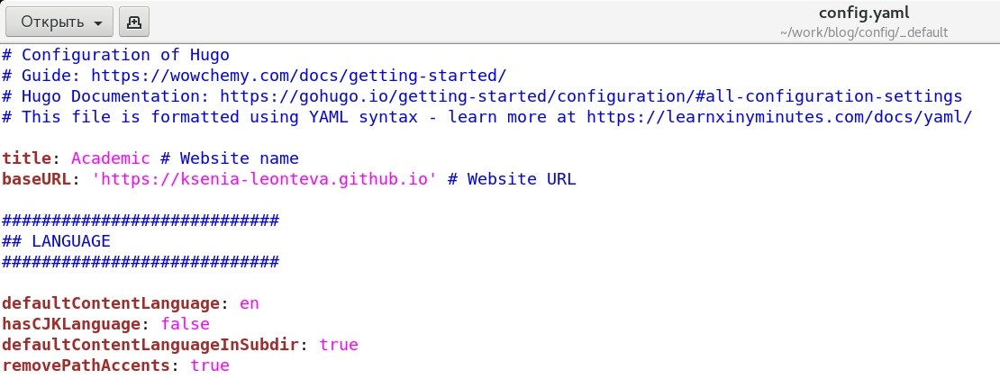{#fig:001 width=110%}

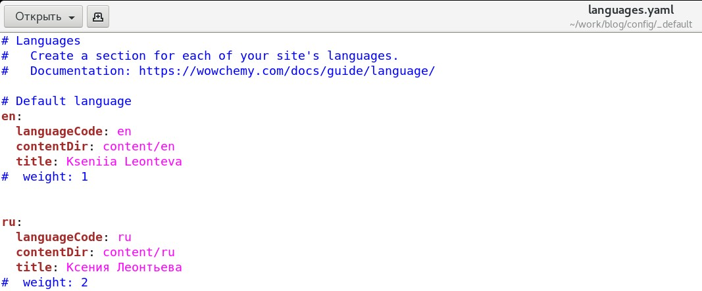{#fig:002 width=110%}

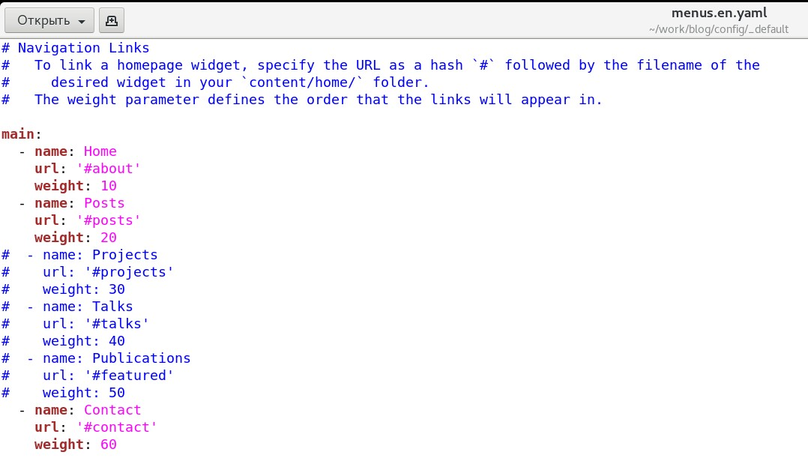{#fig:003 width=110%}

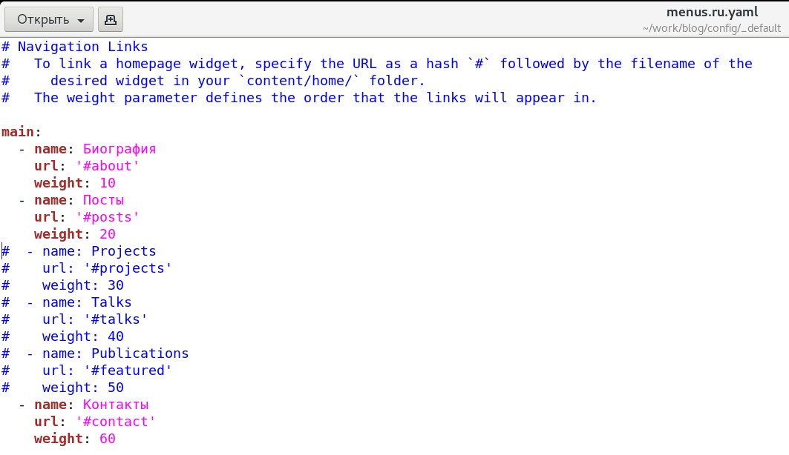{#fig:004 width=110%}

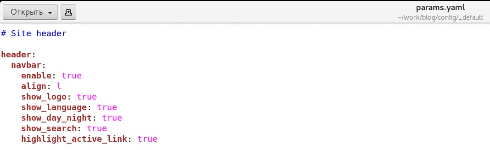{#fig:005 width=110%}

Кроме этого необходимо создать в каталоге work/blog/content два каталога en и ru, в которые переместить каталоги с контентом. В этих же каталогах были созданы каталоги home с файлом index.md (рис. @fig:006 и @fig:007).

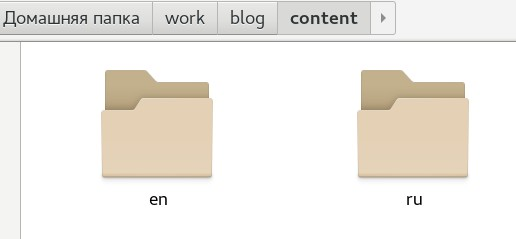{#fig:006 width=80%}

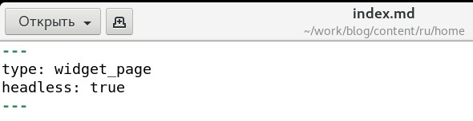{#fig:007 width=80%}

Далее в каталоге work/blog/content/ru были изменены файлы _index.md и authors/admin/_index.md, а именно - переведены на русский заголовки, описание и другие компоненты сайта (рис. @fig:008 и @fig:009).

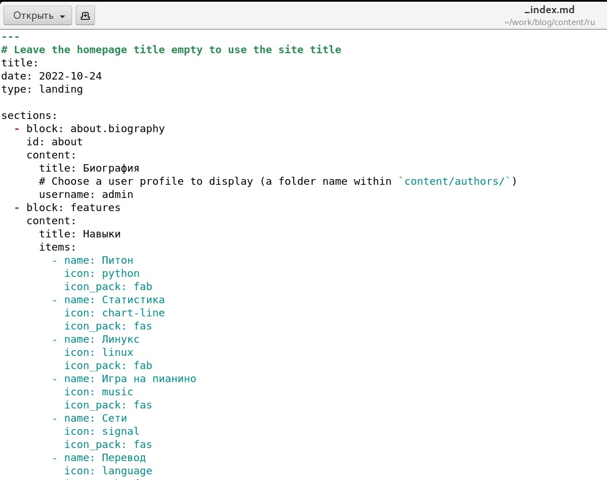{#fig:008 width=110%}

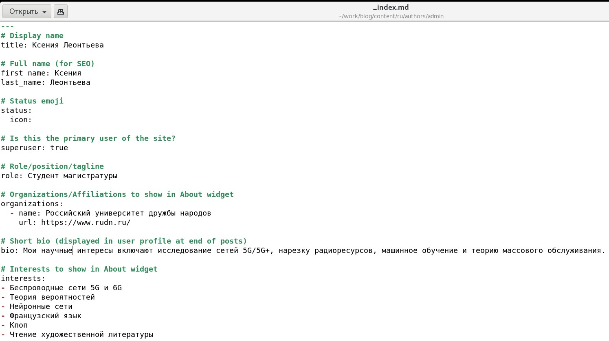{#fig:009 width=110%}

Были созданы каталоги для соответствующих постов на русском и английском (рис. @fig:010 и @fig:013).

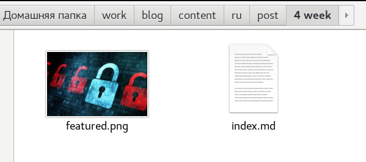{#fig:010 width=80%}

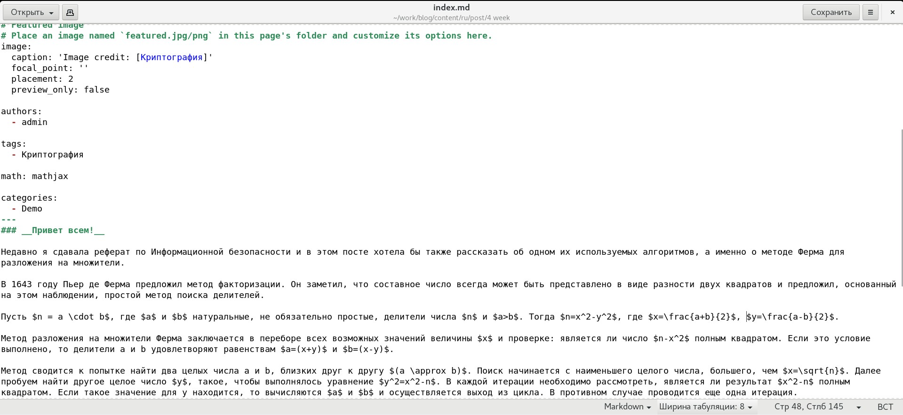{#fig:011 width=110%}

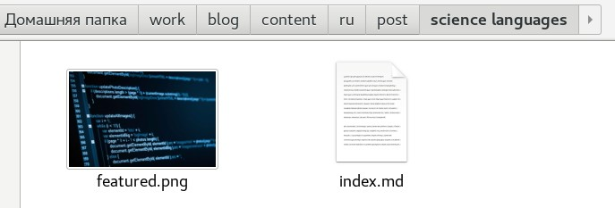{#fig:012 width=90%}

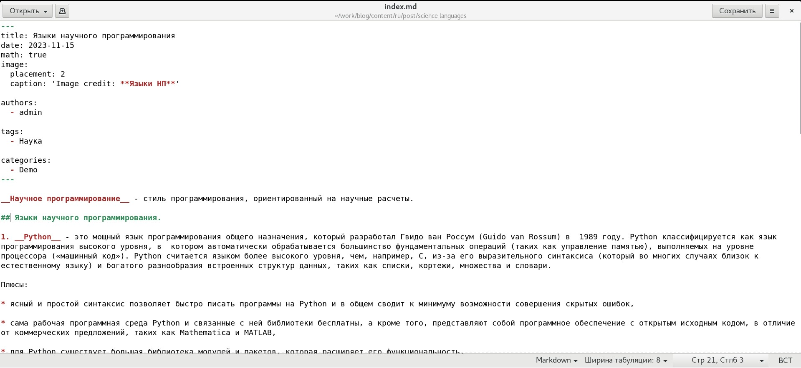{#fig:013 width=110%}

После файлы были загружены на GitHub и запущен hugo (рис. @fig:014).

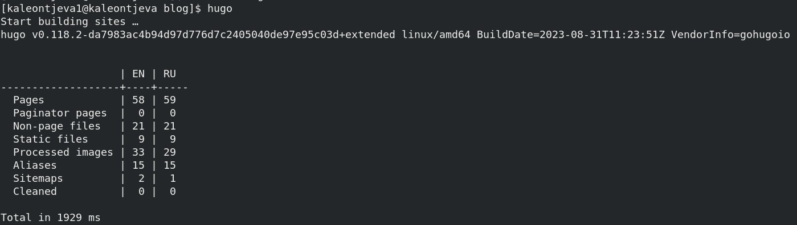{#fig:014 width=110%}

В итоге текущая версия сайта выглядит следующим образом (рис. @fig:015 - @fig:018)

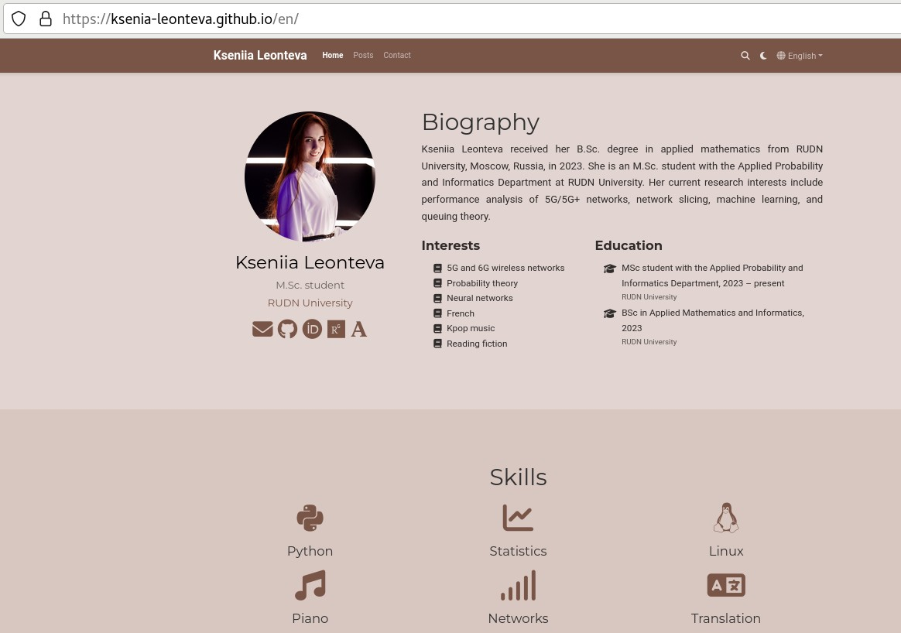{#fig:015 width=110%}

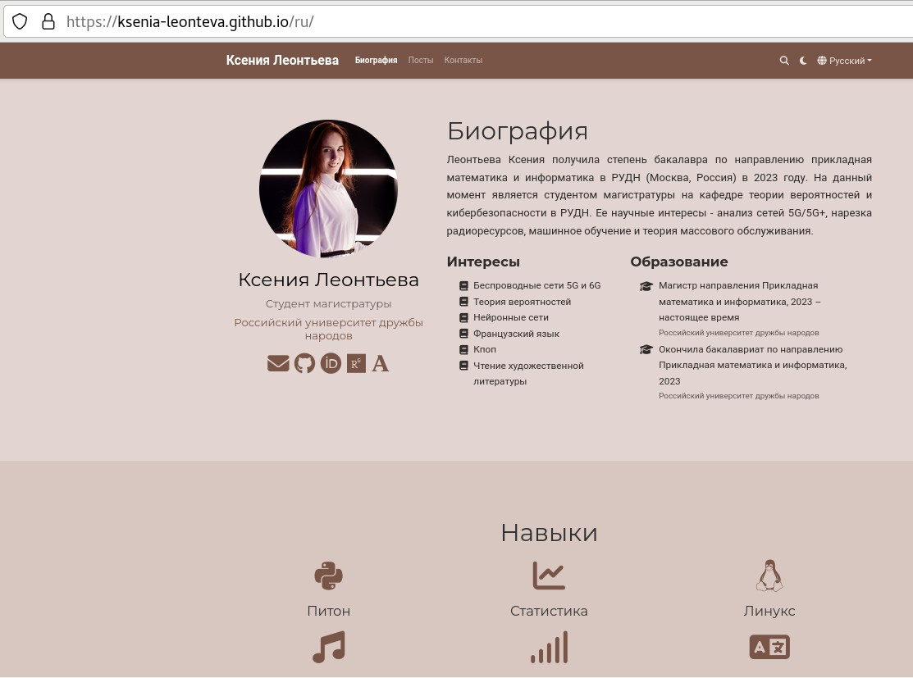{#fig:016 width=110%}

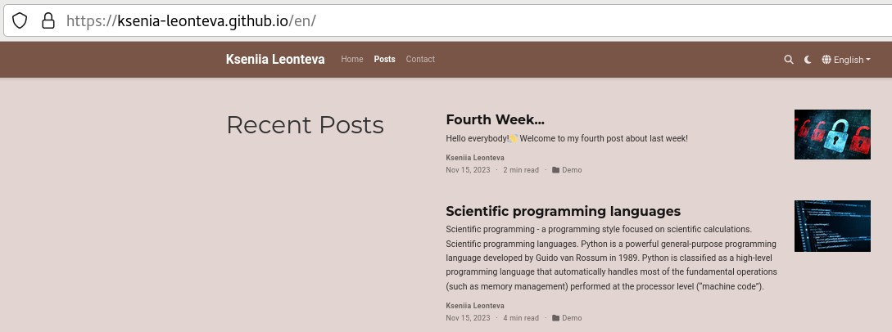{#fig:017 width=110%}

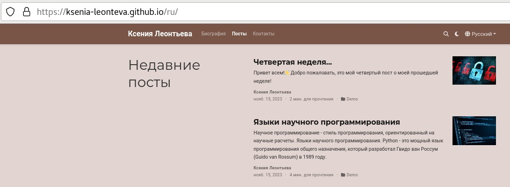{#fig:018 width=110%}

# Выводы

В ходе выполнения пятого этапа индивидуального проекта на GitHub был размещен двуязычный сайт.

# Список литературы{.unnumbered}

::: {#refs}
:::

